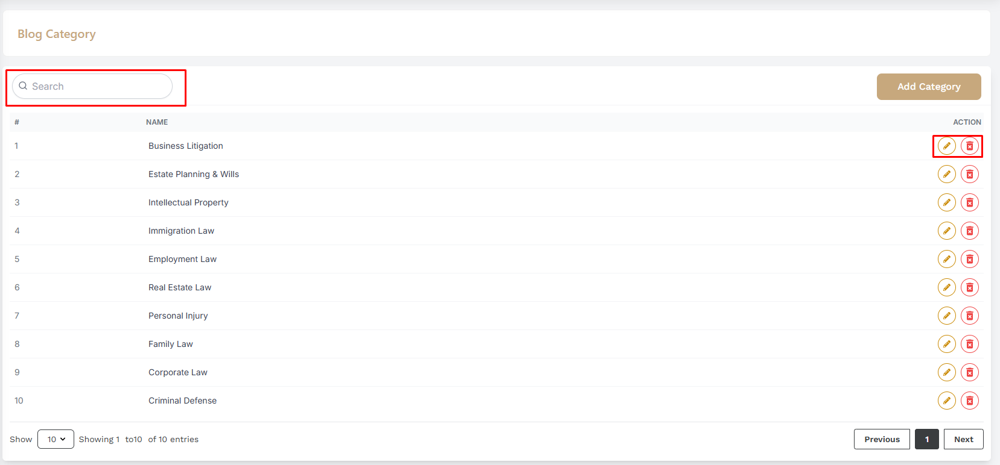
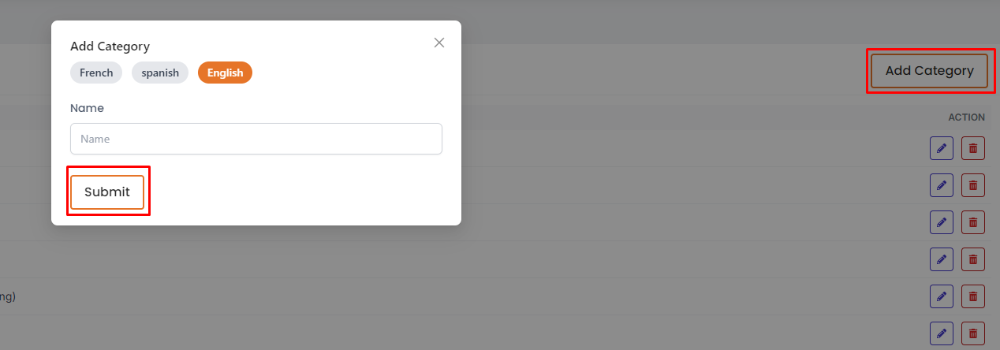
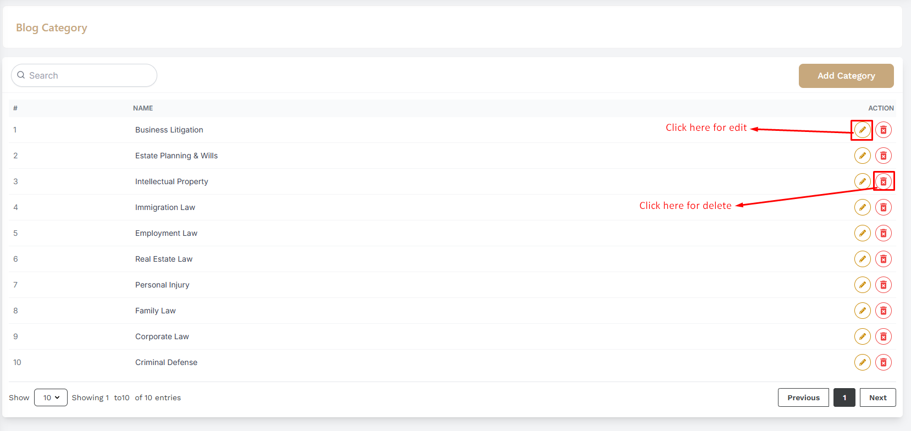

# Blog Categories

- In this section, the admin can create categories for the blog posts.

- The admin will be able to see all the existing categories.

- Admin can search a specific category by using the **search bar** .

## Here is how to add a new category !
- To add a new category, click on the **Add Category** button. A form will appear where you can add a new category.You can add category multiple laguages .After adding the category, click on the **Submit** button to submit the category.

## Here is how to edit and delete a category !

- To edit a category, click on the **Edit** action button. A form will appear where you can edit the category.After editing the category, click on the **Submit** button to submit the category.To delete a category, click the **Delete** action button.

