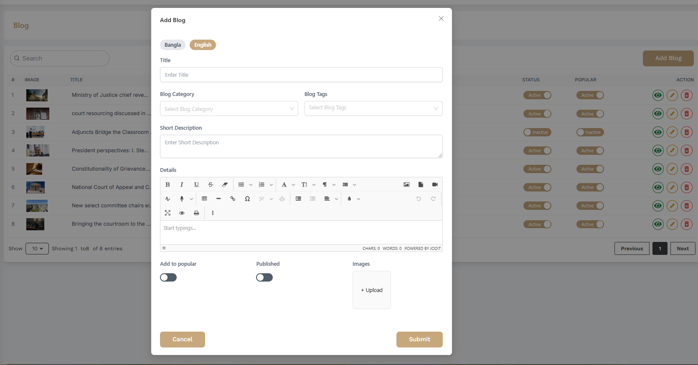

# Blog

- In this section, the admin can create blogs for the site.
- The admin will be able to see all the existing blogs.
- Admin can search a specific blog by using the **search bar**.
- A blog can be kept active which means it will be displayed on the site, if it is kept inactive then it will not appear on the site. Activating the popular button will highlight the specific    blog.

## Here is how to add a new blog!

- To add a new blog, click on the **Add New** button. A form will appear where you can add a new blog.You can add blog multiple laguages .

- After adding the blog, click on the **Submit** button to submit the blog.
 
 

## Here is how to edit a blog!

To edit a blog, click on the **Edit** button. A form will appear where you can edit the blog.After editing the blog, click on the **Submit** button to submit the blog.

 

## Here is how you can see blog details!

To see the details of a blog, click on the **View** button. A modal will appear where you can see the details of the blog.

 