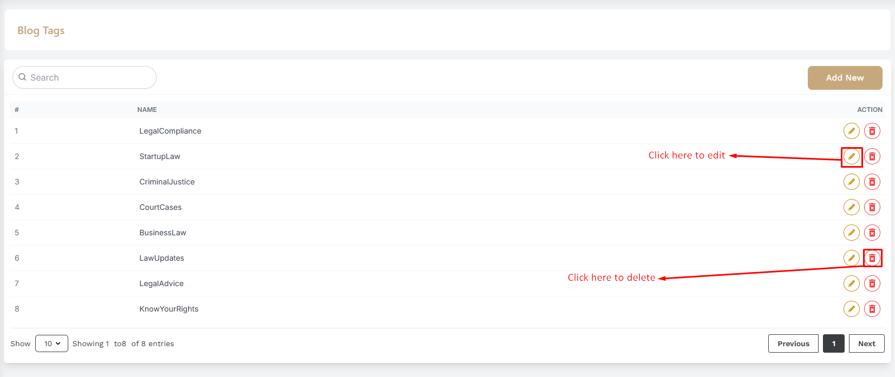

# Blog Tag

- In this section, the admin can create tags for the blog posts.
- The admin will be able to see all the existing tags.
- Admin can search a specific tag by using the **search bar**.

## Here is how to add a new tag !

- To add a new tag, click on the **Add New** button. A form will appear where you can add a new tag.You can add the tag in multiple languages .After adding the tag, click on the **Submit** button to Submit the tag.

## Here is how to edit and delete a tag !

- To edit a tag, click on the "Edit" action button. A form will appear where you can edit the tag.After editing the tag, click on the **Submit** button to Submit the tag.To delete a tag, click the **Delete** action button.

