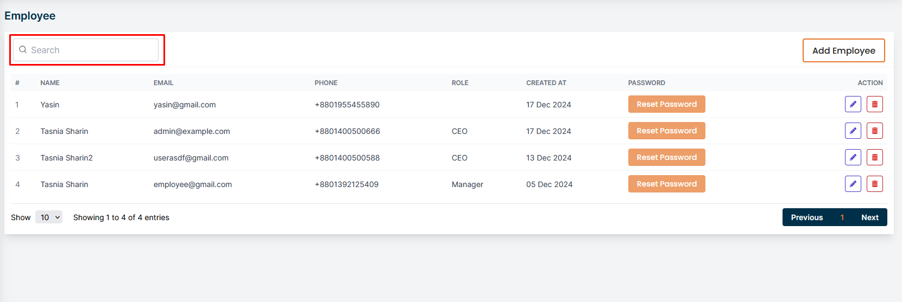
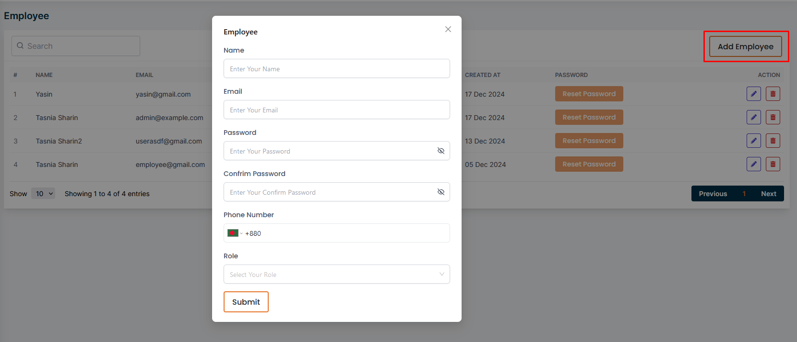
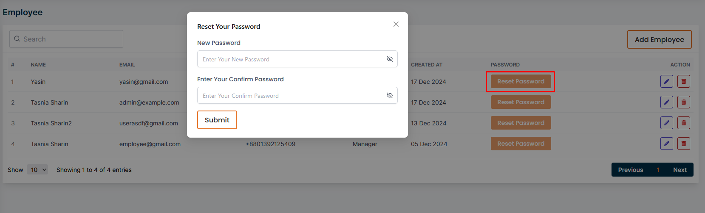
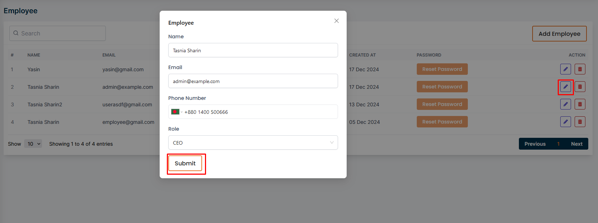
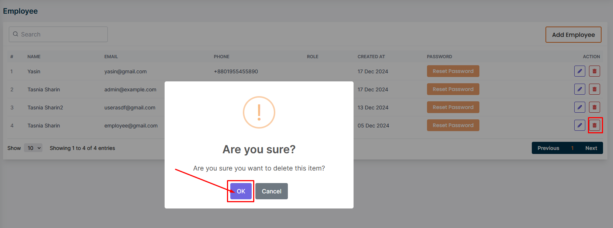

# All Employees
- In this section, the admin will be able to view the list of employees.
- The admin can search for a specific employee by using the **search** bar.

## Here is how to add a new employee!

- The admin can add a new employee by clicking the **Add Employee** button.
- A form will apper in a modal where the admin can fill up all required information to add a new employee.

## Here is how to Reset Password an employee!

- The admin can reset the password of an employee by clicking the **Reset Password** button.

## Here is how to edit an employee!

- The admin can edit an employee by clicking the **Edit** action button.

## Here is how to delete an employee!

- The admin can delete an employee by clicking the **Delete** action button.

