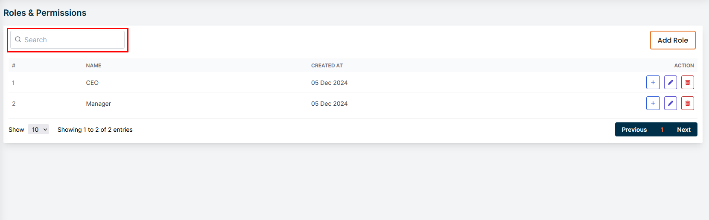
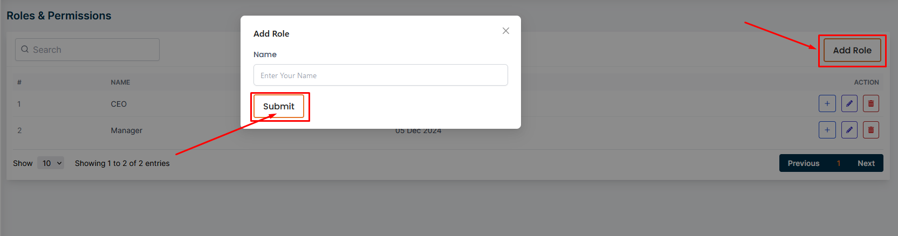
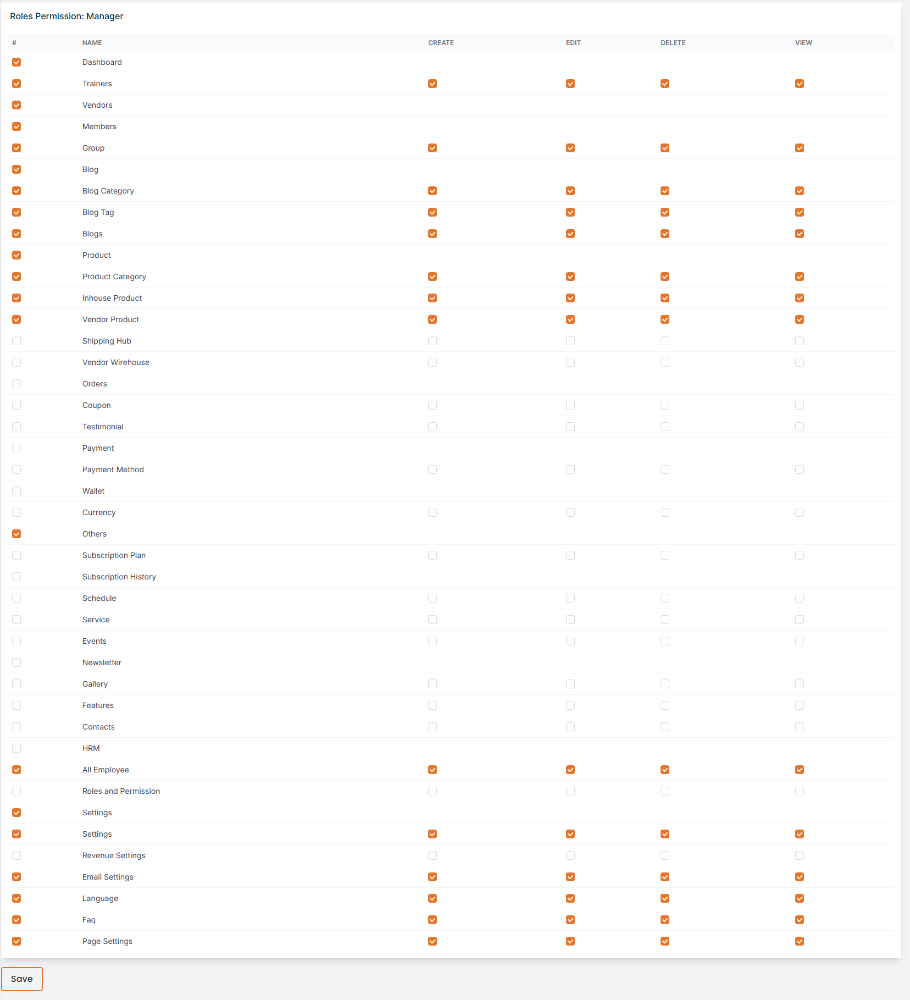
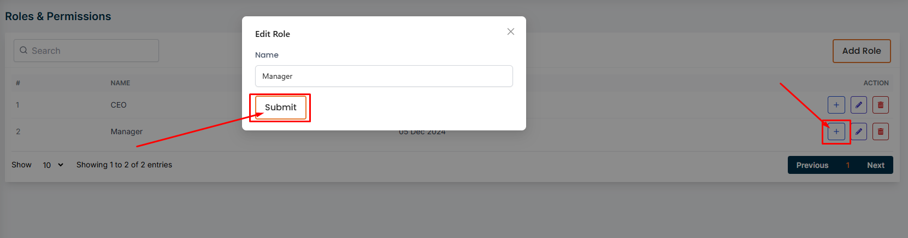
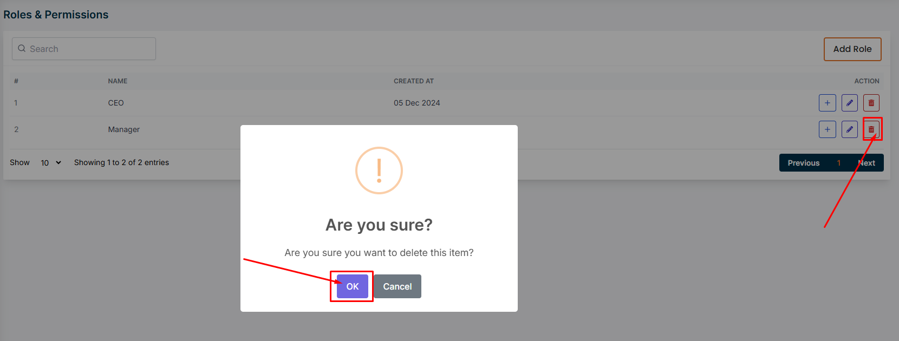

# Roles and permissions

- In this section, the admin will be able to view the list of roles and permissions.
- The admin can search for a specific role or permission by using the **search** bar.

## Here is how to add a new role!

- The admin can add a new role by clicking the **Add Role** button.

- A form will apper in a modal where the admin can fill up all required information to add a new role.

## Here is how to give permissions to a role!

- The admin can give permissions to a role by clicking the **Plus** action button.

- A page will appear where the admin can give permissions to a role.

## Here is how to edit a role!

- The admin can edit a role by clicking the **Edit** action button.

- A form will appear in a modal where the admin can edit information for a role.

  

## Here is how to delete a role!

- The admin can delete a role by clicking the **Delete** action button.

