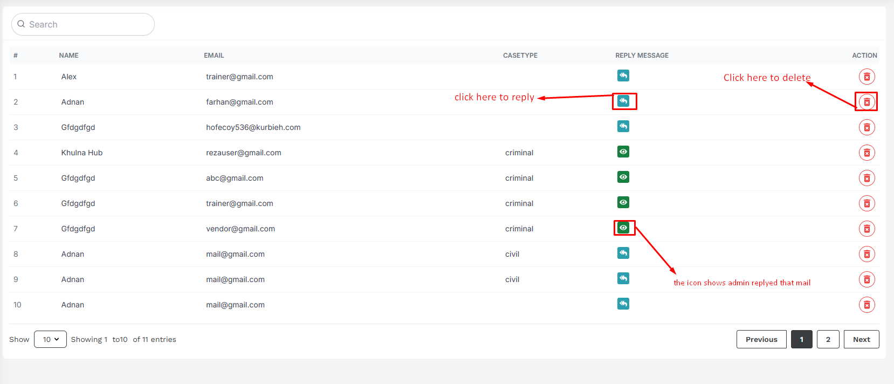

# Schedule

- In this section, the admin can create schedules for the week and assign them to the trainers.

- In this section, the admin will be able to see all the existing schedules.

- The admin can search for specific days by using the **search bar** .

## Here is how to add a new schedule !

- To add a new schedule, click on the **Add Schedule** button. Fill all the required fields and click on the **Submit** button to save the schedule.
<!-- image -->

## Here is how to edit and delete a schedule !

- To edit or delete a schedule, click on the **Edit** or **Delete** action button.

!
