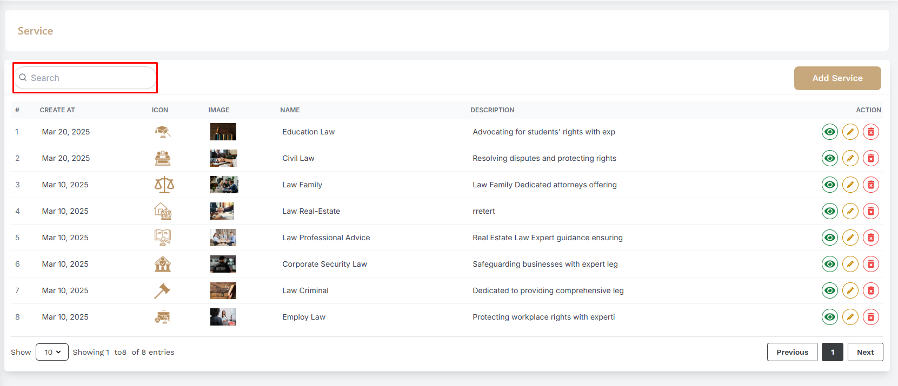

# Service

- In this section, the admin can create services for the site.

- This is the service list page where admin can see all the existing services.

- Admin can search a specific service by using the **search bar**.
<!-- image -->

## Here is how to add a new service !

- To add a new service, click on the **Add New** button. Fill all the required fields and click on the **Submit** button to save the service.
<!-- image -->

## Here is how to edit and delete a service !

- To edit a service, click on the **Edit** action icon. Update the required fields and click on the **Submit** button to save the changes.

- To delete a service, click on the **delete** action icon. Update the required fields and click on the **Submit** button to save the changes.

