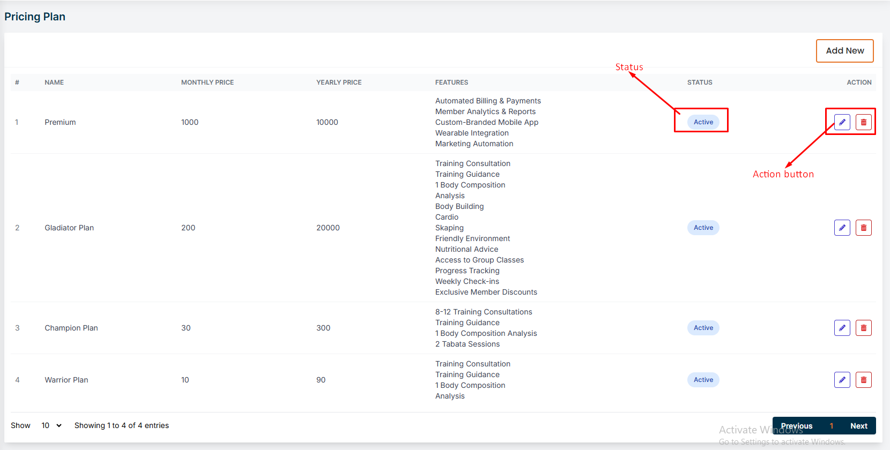
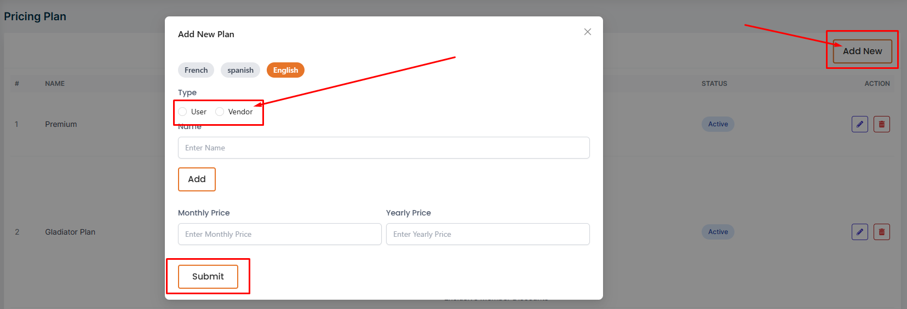
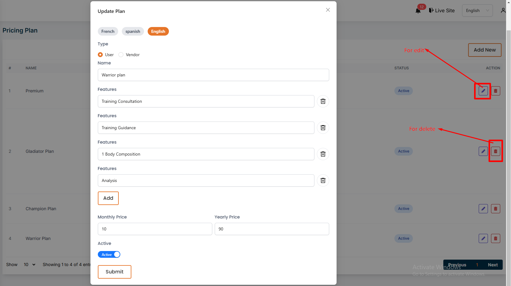

# Subscription plan
- In this section, the admin can create subscrip plans to sell subscriptions for gym services.
- This is the subscrip plan page where admin can see all the existing subscrip plans.
- Admin can see the active status of the subscrip plan.

## Here is how to add a new subscrip plan !
- To add a new subscrip plan, click on the **Add New** button. Fill all the required fields and click on the **Submit** button to save the subscrip plan.
- You can choose a subscription plan for either a user or a vendor.

## Here is how to edit and delete a subscrip plan !
- To edit or delete a subscrip plan, click on the **Edit** or **Delete** action button.

