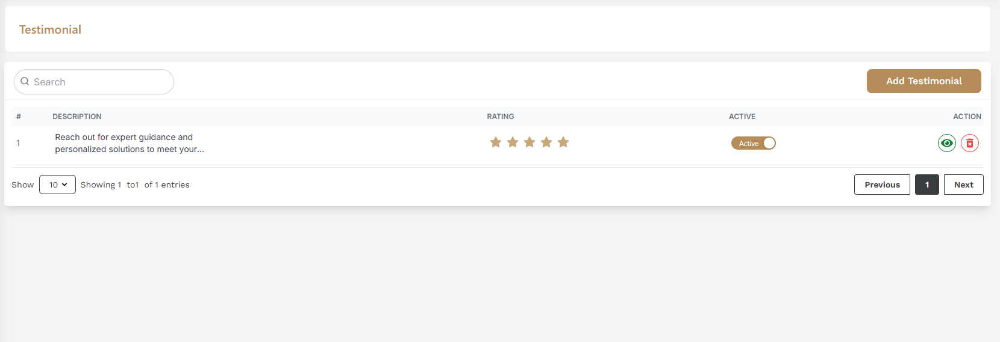
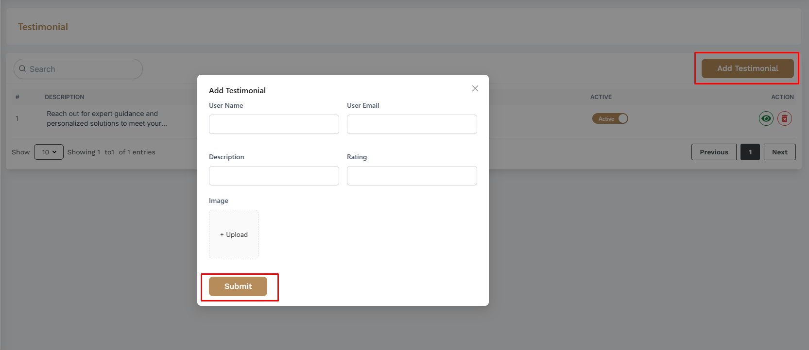
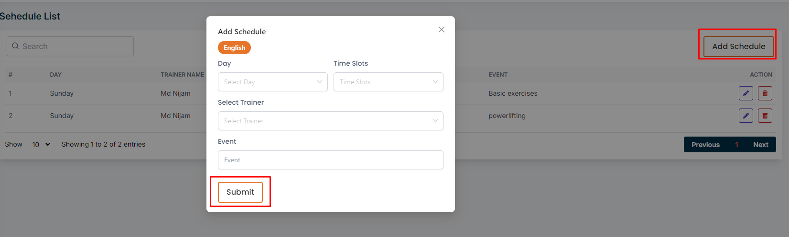

# Testimonial

- In this section, the admin will be able to see all the existing testimonials.
- The admin can search for specific testimonials by using the search bar .
- The admin can publish the testimonial by clicking on the switch inactive button.

## Here is how to add a testimonial !
- To add a testimonial, click on the **Add Testimonial** button.
- Fill in the required fields and click on the **Submit** button.

## Here is how to view and delete a testimonial !
- To view a testimonial, click on the View button.
- To delete a testimonial, click on the Delete button.

