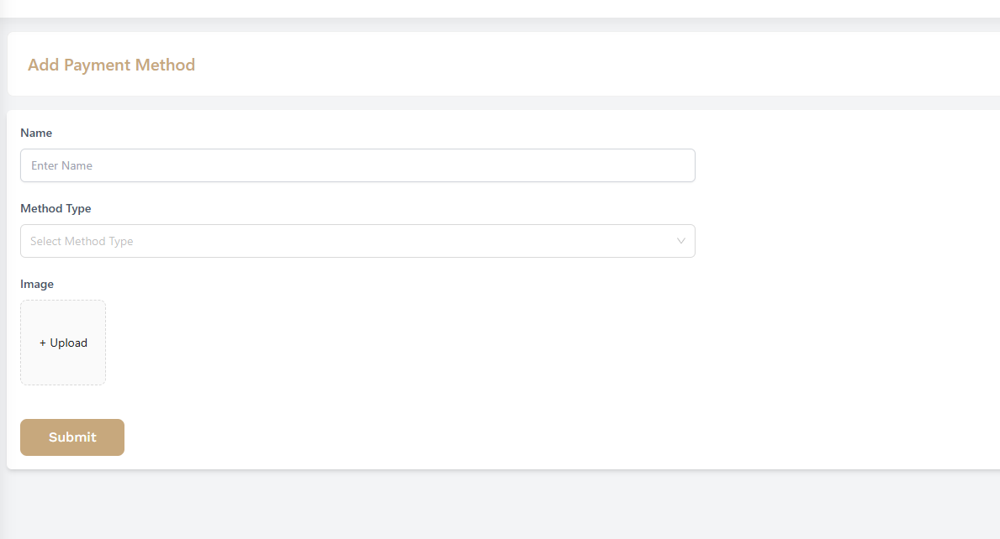
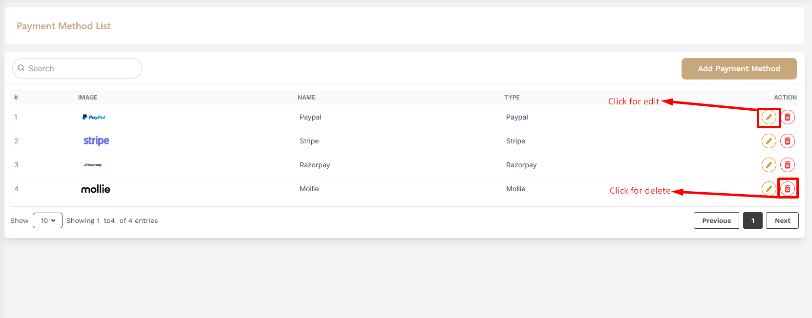

# Payment Methods

- This is the payment method page where admin can Add payment methods for the customers.

- In this section, the admin will be able to see all the existing payment methods.

## Here is how to add a new payment method !
- Additionally, new payment method can be created using the **Add Payment Method** Button and form will be displayed then fill all the required fields and click on the **Submit** button to save the payment method.

## Here is how to edit and delete a payment method !

- Admin can delete or edit using the **Action buttons** .

- Clicking on the **Edit** action button will open the form with the existing data and you can edit the data and click on the **Update** button to save the changes.