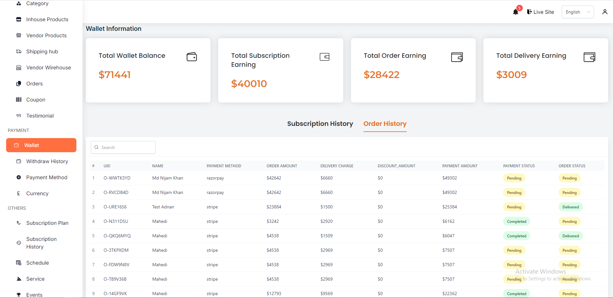
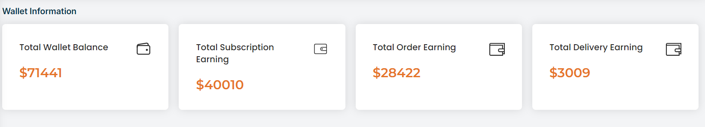
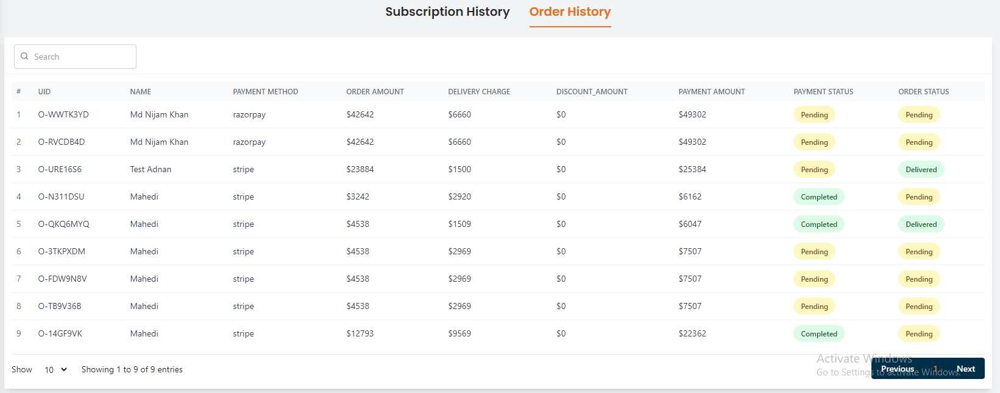

# Wallet

## Wallet Information Section

- This page provides an overview of wallet balances, subscription earnings, order earnings, and delivery earnings.
- Displays the total amount of money available in the wallet, highlighted in an orange card for visibility.
- Shows the total earnings from subscriptions, represented in an orange card.
- Indicates the total earnings from orders, displayed in an orange card.
- Shows the total earnings from delivery services, represented in an orange card.

## Subscription History Section

- Lists detailed information about subscription payments, including UID, name, subscription type, payment method, subscription charge, and payment status.
- Features search and pagination for easy navigation.

## Order History Section 

- Lists detailed information about order payments, including UID, name, payment method, order amount, delivery charge, discount amount, payment amount, payment status, and order status.
- Features search and pagination for easy navigation.
