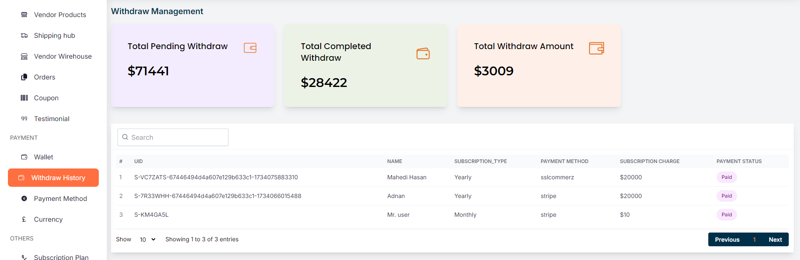

# Withdraw History

- This page allows the admin to manage withdrawal requests and view relevant financial metrics.
-  Displays the total amount of money currently pending for withdrawal, highlighted in a purple card for visibility.
-  Shows the total amount of money that has been successfully withdrawn, represented in a green card.
- Indicates the total amount of money available for withdrawal, shown in an orange card.
- Lists detailed information about each withdrawal request, including UID, name, subscription type, payment method, subscription charge, and payment status, with search and pagination features for easy navigation.