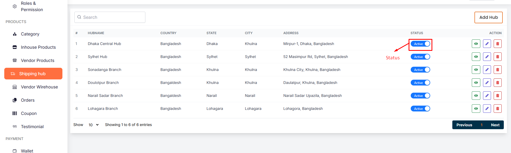
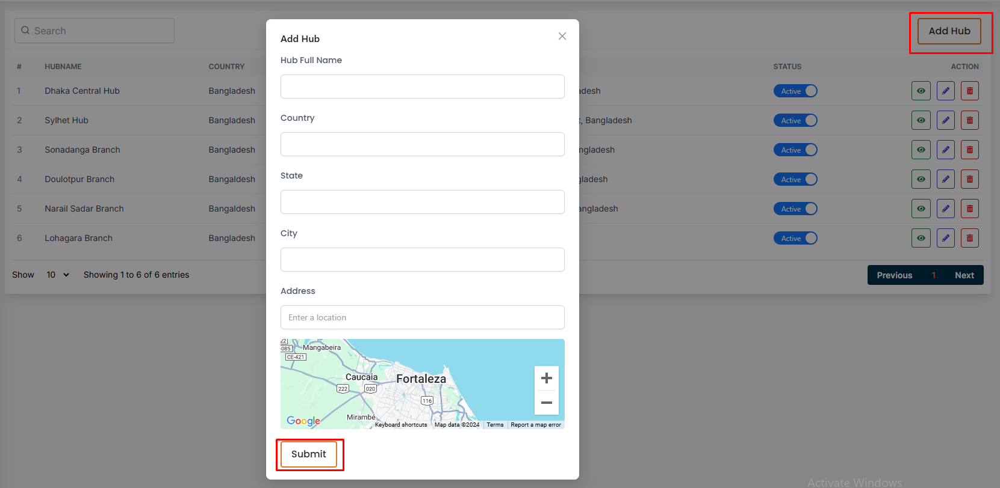
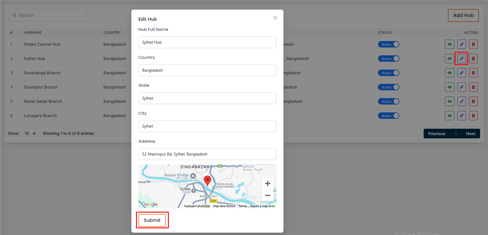

# Shipping Hub

- In this section admin can see all shipping hub list. 
- Admin can search a shipping hub by using the **search bar** .
- Admin can change status by useing toggle button .

## Here is how to add a new shipping hub 

- Clicking on **Add Hub** and fill all the required fields and click on the **Submit** button to save the Shipping hub.

## Here is how to update a shipping hub

- To edit a hub, click on the **Edit** action button. A form will appear where you can edit the hub.

- After editing the hub, click on the **Submit** button to Submit the shipping hub.

- To delete a hub, click the **Delete** action button.

