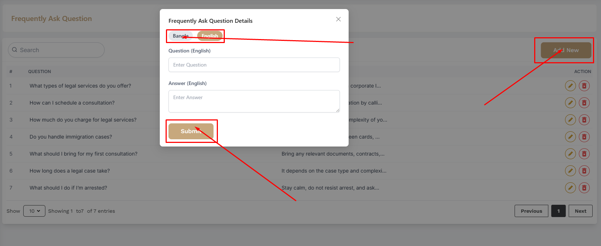

# FAQ

- In this section, the admin can create FAQ for the users quries.

- In this section, the admin will be able to see a list of FAQs.

## Here is to add a new FAQ !

- To add a new FAQ, click on the **Add New** button. A form will appear where you can add a new FAQ. You can add tag multiple laguages .After adding the FAQ, click on the Submit button to Submit the FAQ.

## Here is to edit and delete FAQ !

- To edit a FAQ, click on the **Edit** button. A form will appear where you can edit the FAQ. After editing the FAQ, click on the **Submit** button to Submit the FAQ.

- To delete a FAQ, click on the **Delete**action button.

