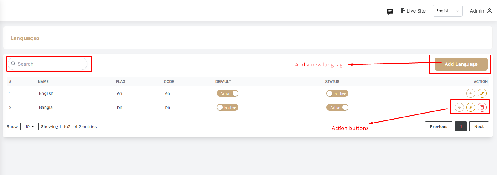
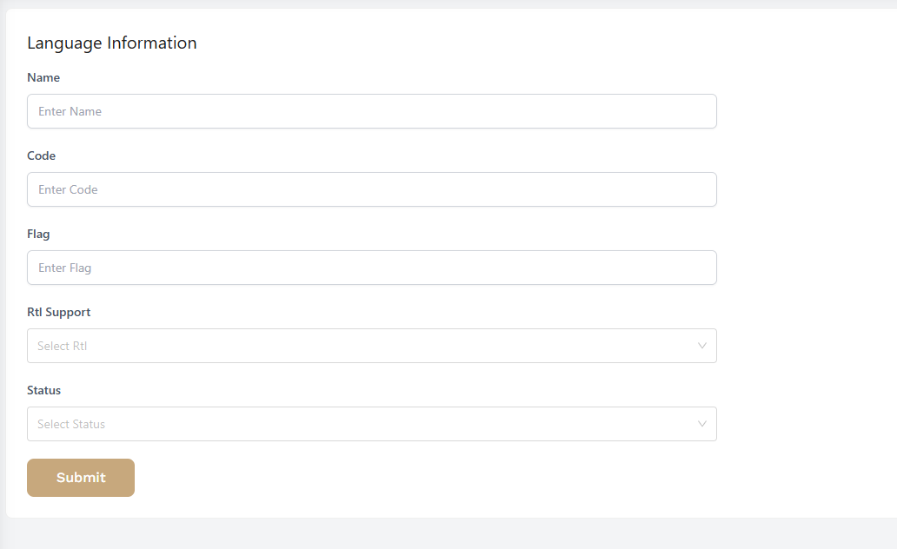

# Languages

- In this section, the admin will be able to see all the existing languages. Admin can edit, delete and view using the **Action buttons**.

## Here is how to add a new language !

- To add a new language, click on the **Add Language** button. A form will appear where you can add a new language. After adding the language, click on the **Submit** button to Submit the language.

## Here is how to edit a language !

- To edit a language, click on the **Edit** button. A form will appear where you can edit the language. After editing the language, click on the Submit button to Submit the language.

- You can also translate some static text manually useing the **Translate** button icon.

