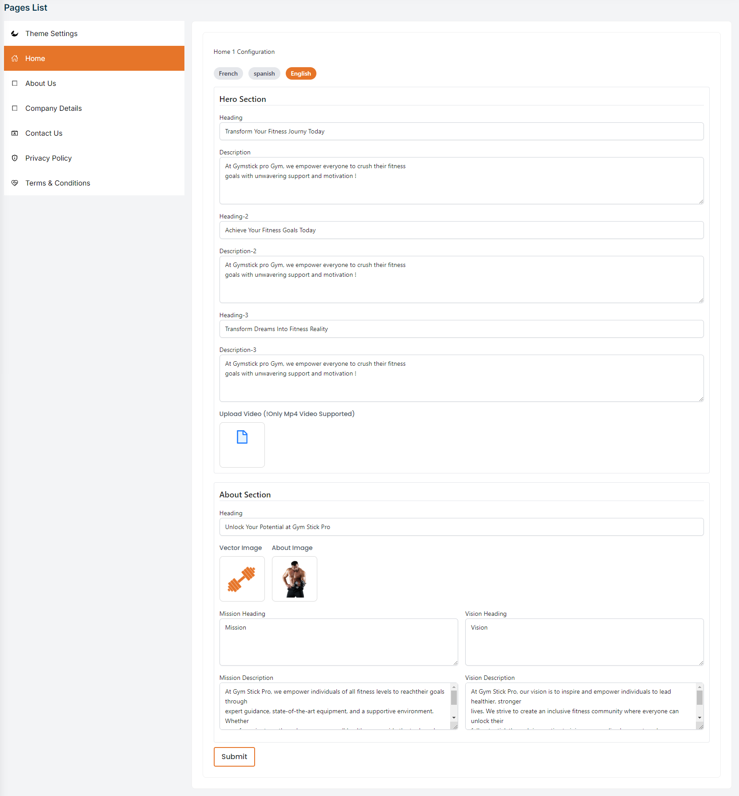
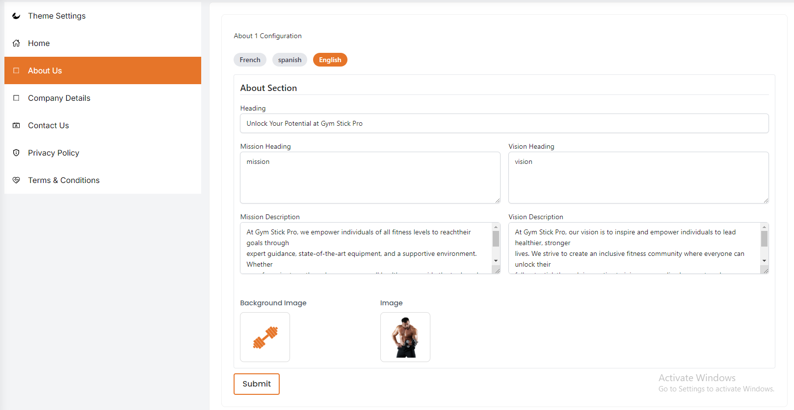
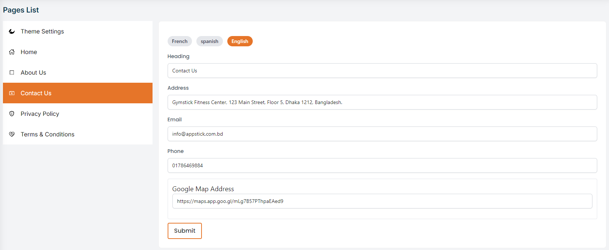
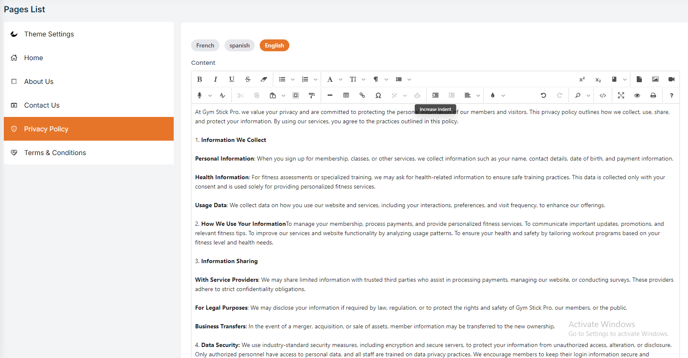
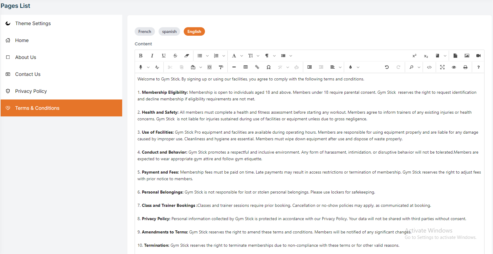

# Page Settings

- In this section, the admin will be able to edit fields which will appear on different parts of the site.

## Theme Setting

- The admin can choose from different themes displayed on the Theme Setting page. Each theme offers a distinct design and layout for the home page, allowing the admin to select the one that best fits their preferences.

- The admin can hover over the themes to view a full-page auto-scroll preview.

- The Theme Setting page provides flexibility for the admin to switch between themes and customize the appearance of the website according to their needs and preferences.

## Home #

- Set the heading, description, and upload images and videos for the hero section.

- Set the heading, description, and manage images for the about section, including mission, vision.

## About Us #

- Heading : Set or change the main heading for the About Page.
- Description : Edit the description to provide an overview of the gyms philosophy and offerings.
- Image & Text : Edit the text and upload images for the Mission, Vision.

## Contact Us #

- Contact page : The contact page to provide contact information and a contact form.

## Privacy Policy #

- Privacy Policy: The privacy policy page to provide information about the gyms privacy policy.

## Terms and Conditions #

- Terms and Conditions: The terms and conditions page to provide information about the gyms terms and conditions.

   