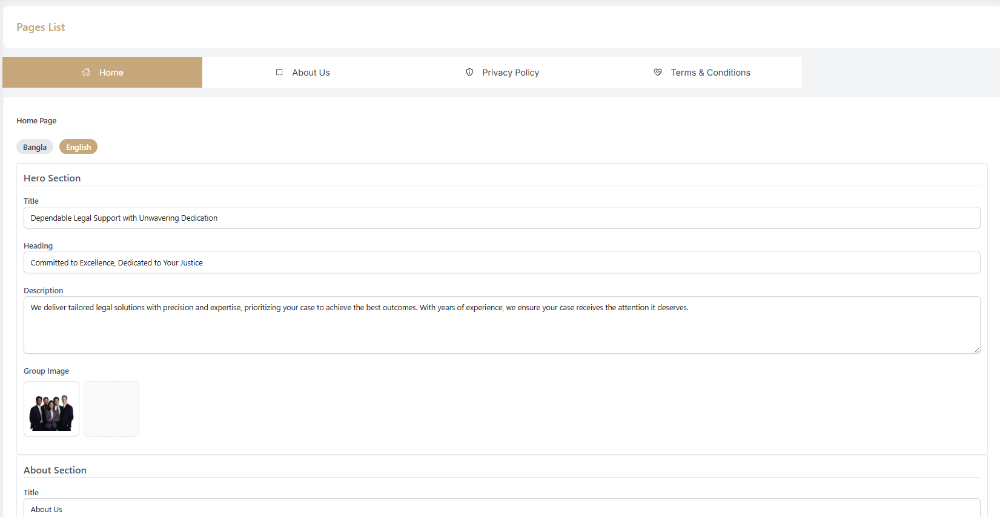
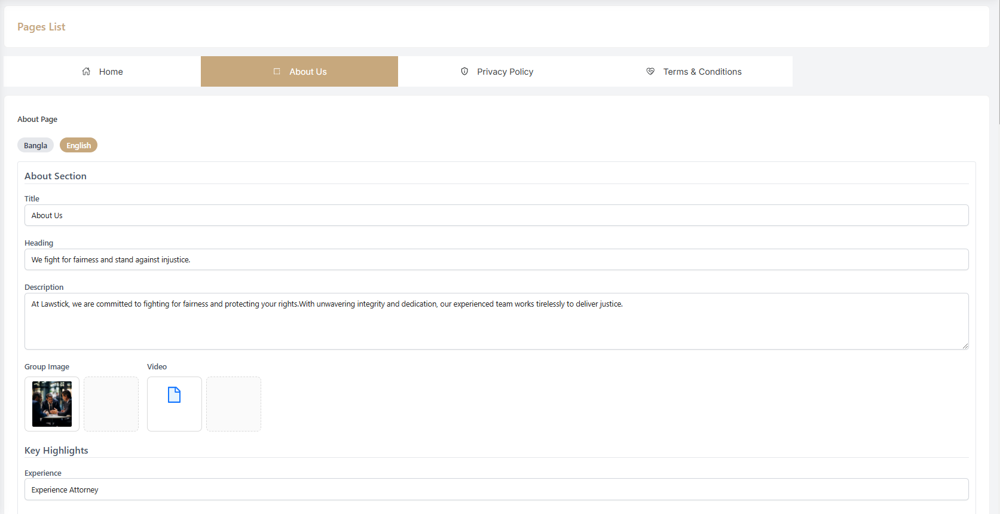
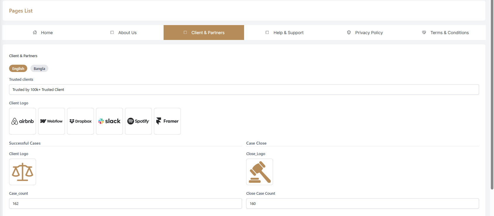
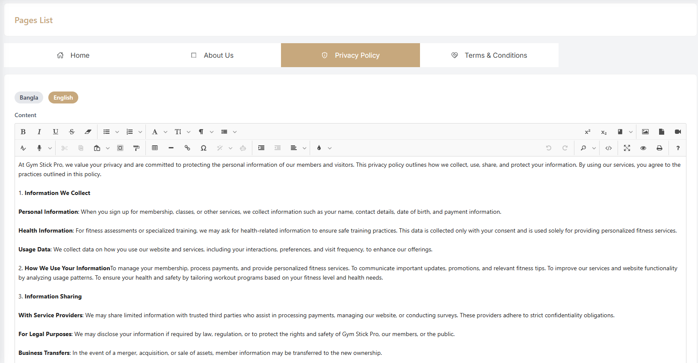
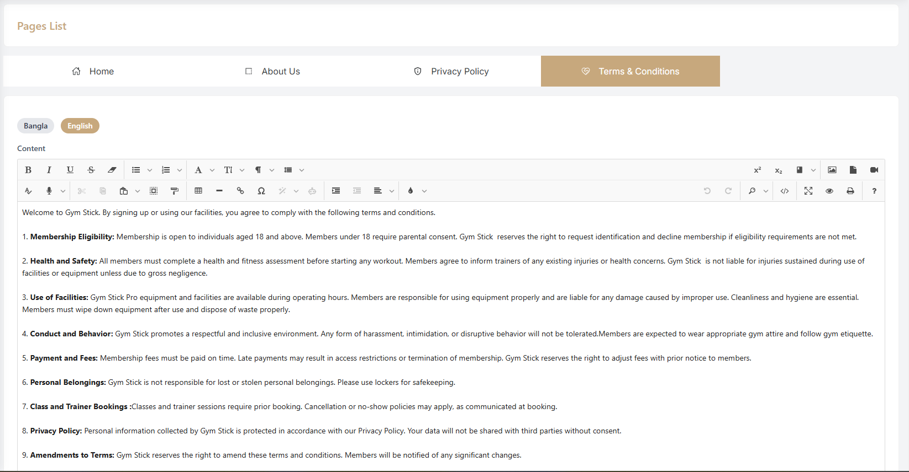

# Page Settings

- In this section, the admin will be able to edit fields which will appear on different parts of the site.

## Home #

- Set the heading, description, and upload images and videos for the hero section.

- Set the heading, description, and manage images for the about section, including mission, vision.

## About Us #

- Heading : Set or change the main heading for the About Page.
- Description : Edit the description to provide an overview of the law philosophy and offerings.
- Image & Text : Edit the text and upload images for the Mission, Vision.

## Client & Partner #

- Admin can add and remove client and partner logos to the page.
- Admin can also edit the display order of the logos.

## Help & Support #

- Help & Support: The help and support page to provide information to users and attorneys about their lawfirm.

## Privacy Policy #
    
- Privacy Policy: The privacy policy page to provide information about the lawfirm privacy policy.

## Terms and Conditions #

- Terms and Conditions: The terms and conditions page to provide information about the lawfirm terms and conditions.

