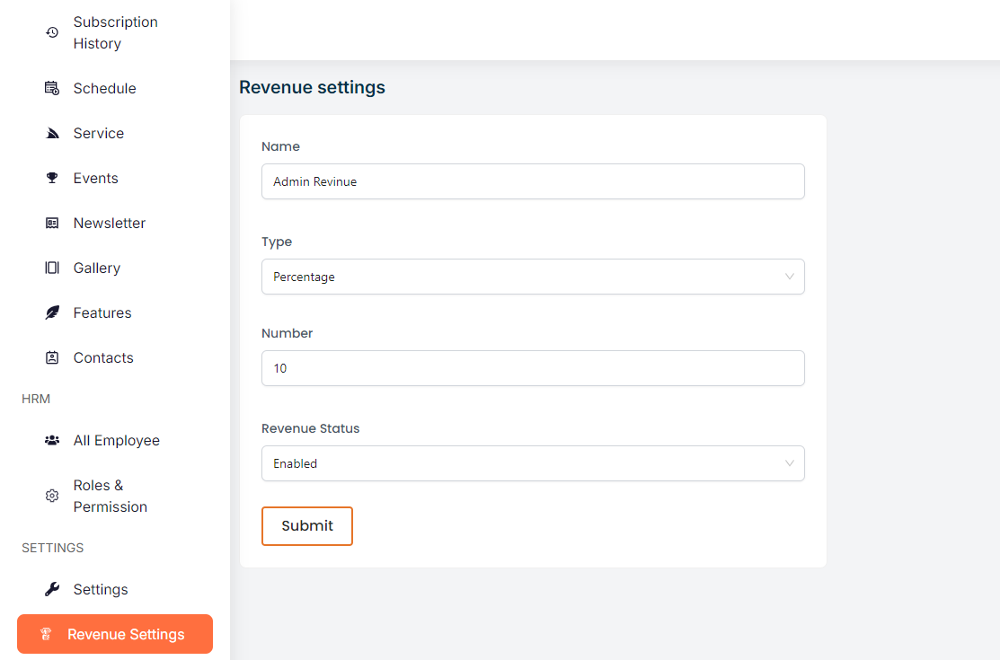

# Revenue Settings

- The admin can view and configure revenue settings in this section. 

- If a vendor has not purchased a subscription, a portion of the revenue from each product sold will be shared with the admin.

- The percentage of revenue to be shared can be set by the admin here.

