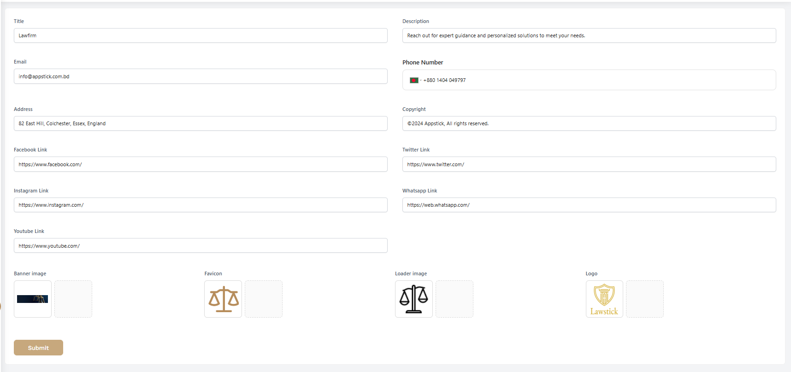

# Settings

- In this section, the admin will be able to see all the existing settings.

- Admin can change the settings by his required fields and clicking on the **Submit** button to save the changes.

<!--  -->