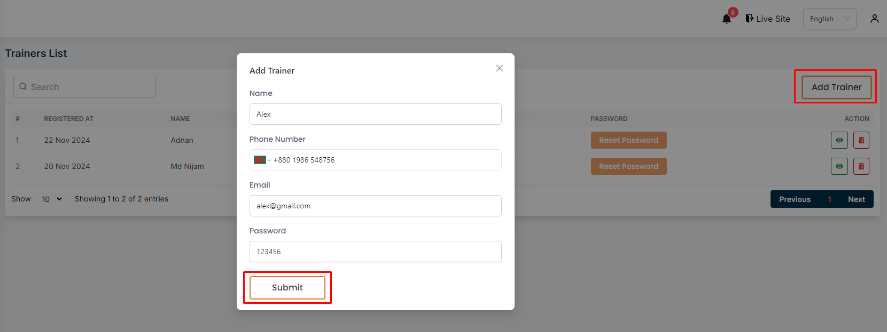
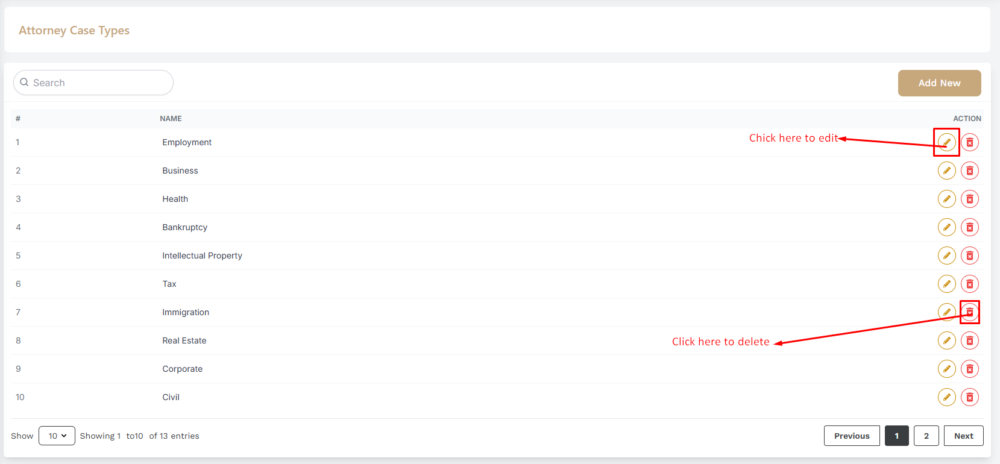
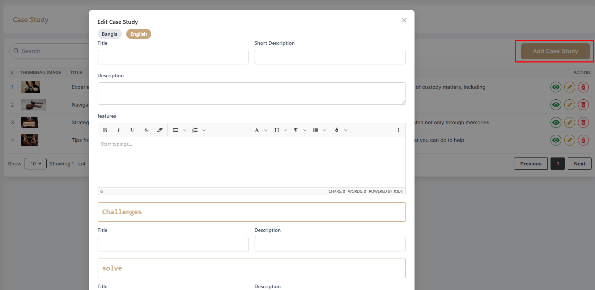

# Attorney

- In this section, the admin will be able to see all the existing attorneys and Admin can search a specific attorney by using the **Search Bar**.

<!--  -->

## Here is how you can add a new attorney !

- In this section, the admin will be able to add attorneys and by clicking the **Add Attorney** button, you can add a new attorney.

<!--  -->

<!--  -->

## Here is how you can edit a attorney !

- In this section, the admin will be able to edit a specific attorney by clicking the **Edit** action button.

- The admin can edit the attorney's information and click the **Submit** button to save the changes.

## Here is how you can delete a attorney !

- In this section, the admin will be able to delete a specific a attorney by clicking the **Delete** action button.

<!--  -->