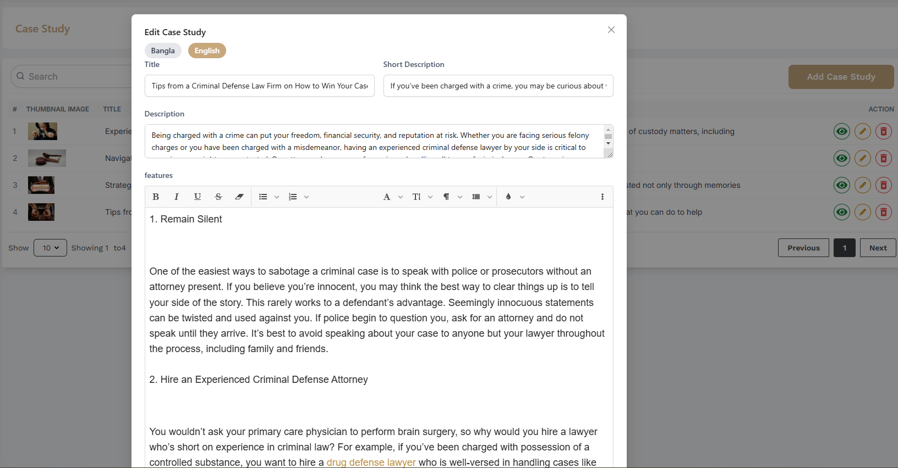

# Case Study

- In this section, the admin can upload complex case studies to share with users.
- Admin can change it according to his requirement.

## Here is how admin can upload a case study?

- Admin can upload a case study by clicking the **Add Case Study** button.

- A modal will open where the admin can upload the case study.

## Here is how admin can edit a case study?

- To edit a case study, click on the **Edit** button. 

- A form will appear where you can edit the case study.After editing the case study, click on the **Submit** button to submit the case study.

## Here is how admin can view a case study?

- To view a case study, click on the **View** button.

## Here is how admin can delete a case study?

- To delete a case study, click on the **Delete** button.

