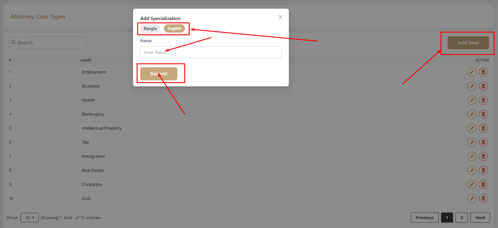

# Case Type

- The admin can create new case types and assign them to specific attorneys, defining the types of cases they are authorized to handle.

- In this section, the admin will be able to see all the existing case types and Admin can search a specific case type by using the **Search Bar**.

## Here is how you can add a new case type !

- In this section, the admin will be able to add case types and by clicking the **Add New** button, you can add a new case type.

## Here is how you can edit and delete a case type !

- In this section, the admin will be able to edit a specific case type by clicking the **Edit** action button.

- The admin can edit the case type's information and click the **Submit** button to save the changes.

- In this section, the admin will be able to delete a specific case type by clicking the **Delete** action button.

