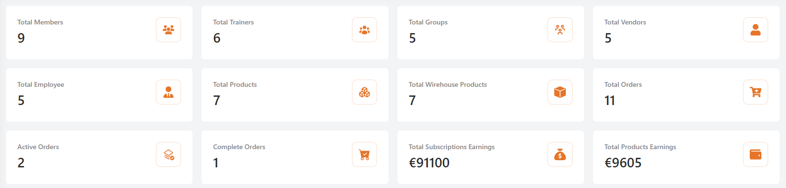
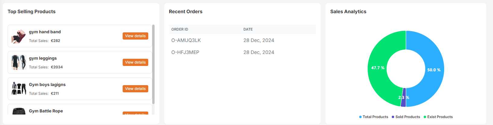
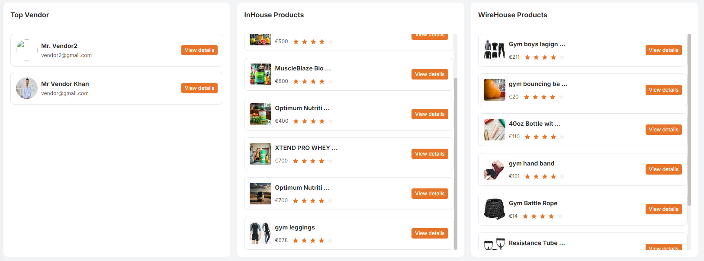

# Admin Dashboard

The admin dashboard is the central hub for administrators after a successful login. It provides a comprehensive overview of key metrics and statistics essential for managing the platform effectively.

## Total static Metrics
 
### Total Members

- Displays the total number of registered members.

### Total Trainers

- Shows the total number of trainers.

### Total Groups

- Indicates the number of active groups.

### Total Vendors

- Reflects the total number of vendors associated.

### Total Employees

- Number of employees currently working.

### Total Products

- Total products listed in the inventory.

### Total Warehouse Products

- Products available in the warehouse.

### Total Orders

- Total number of orders placed.

### Active Orders

- Number of orders that are currently active.

### Complete Orders

- Number of orders that have been completed.

### Total Subscriptions Earnings

- Total earnings from subscriptions.

### Total Products Earnings

- Total earnings from product sales.

## Top Selling Products
- List of Best-Selling Products
- Displays the top-selling products by sales volume.

## Recent Orders
- List of Latest Orders
- Shows the most recent orders placed.
- Includes Order ID and Date (e.g., 0-9L8GJPK on 25 Dec, 2024).

## Sales Analytics
- Sales distribution chart
- Visual representation of sales analytics.
- Pie chart showing percentage distribution among total Products, sold Products, and exist Products.

## Top Vendor
- List of Top vendors
- Displays vendors with high performance or sales.
- Includes vendor names and ratings .

## Inhouse Products
- List of In-House Products
- Displays products that are managed internally.

## Warehouse Products
- List of warehouse Products
- Displays products stored in the warehouse.
