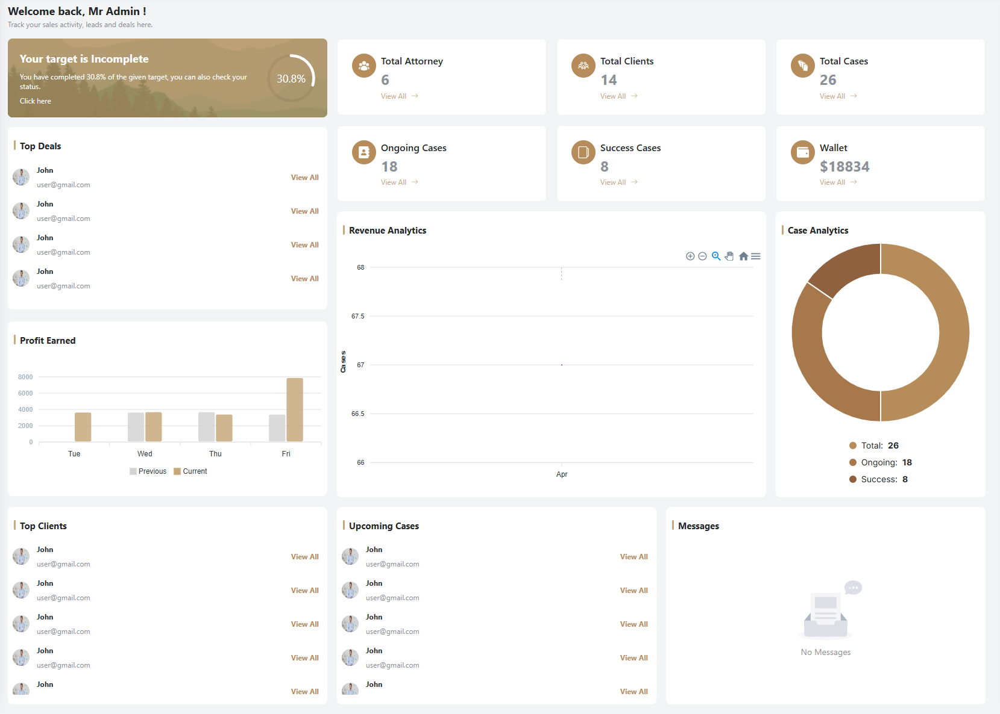

# Admin Dashboard

The admin dashboard is the central hub for administrators after a successful login. It provides a comprehensive overview of key metrics and statistics essential for managing the platform effectively.

- The dashboard contains the following sections:

  - **Dashboard**: This is the main page of the application, where you can see an overview of your account.

  - **Users**: This section allows you to manage and view all users on the platform.

  - **Attorneys**: This section allows you to manage and view all attorneys on the platform.

  - **Appointments**: This section allows you to manage and view all appointments on the platform.

  - **Messages**: This section allows you to manage and view all messages on the platform.

  - **Revenue**: This section allows you to manage and view all revenue on the platform.

  - **Case Analtics**: This section allows you to manage and view all case analytics on the platform.

  - **Top Clients**: This section allows you to show all top clients on the platform.