# Email Option  

- In this section, the admin can send emails to the his all members, trainer, marketing groups,employees and subscribers.
- The admin can select the email template that will be send .
- The admin can send emails immediately using Send Now or schedule them for a later time.

import Tabs from '@theme/Tabs';
import TabItem from '@theme/TabItem';

<Tabs defaultValue="send" values={[
  {label: 'Send Email', value: 'send'},
  {label: 'All Email', value: 'all'},
  {label: 'Scheduled Email', value: 'scheduled'},
  {label: 'Pending Email', value: 'pending'},
  {label: 'Delivered Email', value: 'delivered'},
  {label: 'Failed Email', value: 'failed'},
]}>

<TabItem value="send">

## Send Email

# Here is how to send emails !

- In this section, the admin can send emails to the his all members, trainer, marketing groups,employees and subscribers (subscribers are thoese who have subscribed to our newsletter) or admin can send individual emails to a specific member, trainer, marketing group or employee.
- The admin can choose an email template to send and set the email subject.
- The admin can send emails immediately using Send Now or schedule them for a later time.

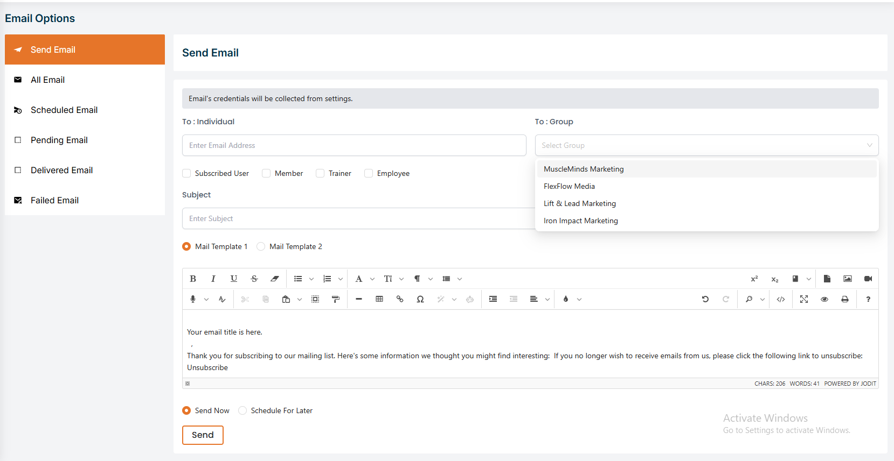

**when you click on the schedule button then you will see a calendar and you can select the date and time to send the email automatically**

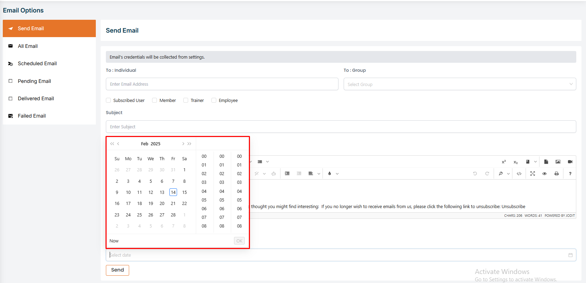

</TabItem>

<TabItem value="all">

## All Email

# Here is how can see send all emails list !
- In this section, the admin can see the list of all emails that have been sent to the members, trainers, marketing groups, employees and subscribers.
- The admin can see the status of the email whether it has been sent or not.

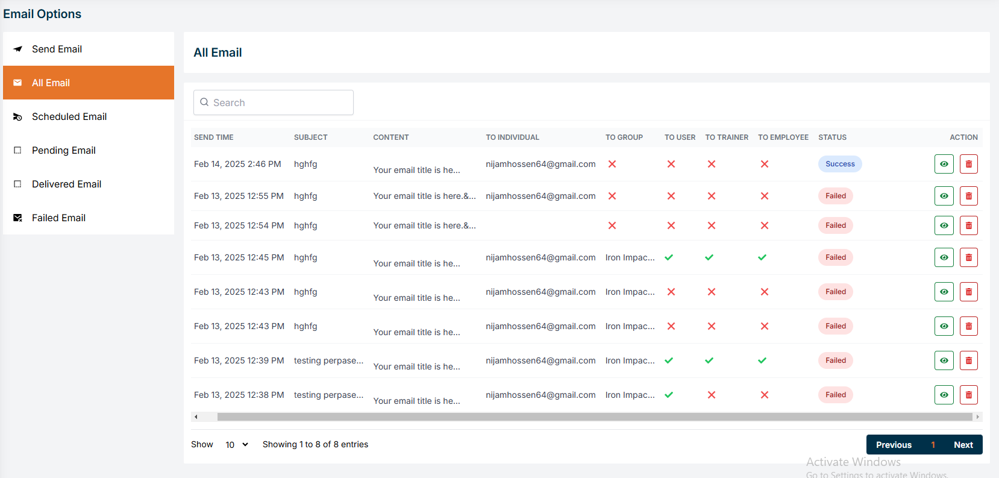

# Here is how can see sended emails details !
- Click on the view button to see the details of the email that has been sent.

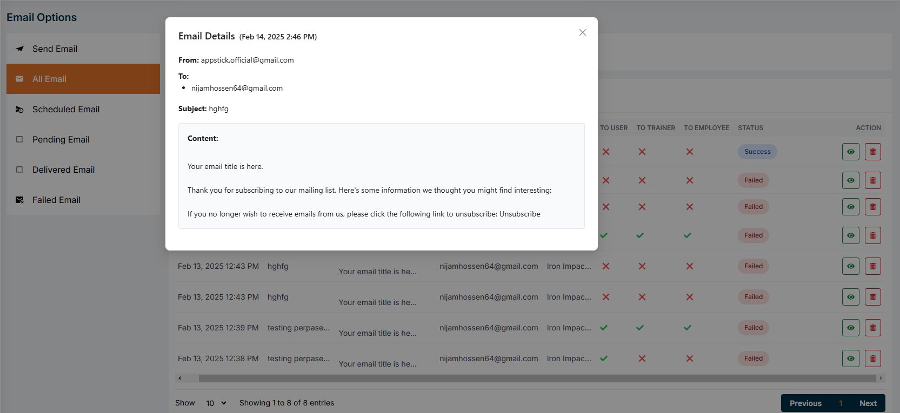

# Here is how to delete an email !

- Click on the delete button to delete the email that has been sent.

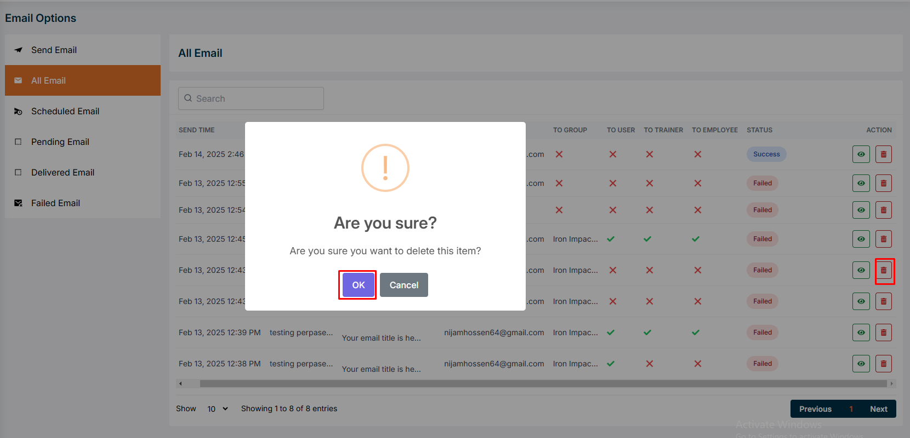

</TabItem>

<TabItem value="scheduled">

## Scheduled Email

# Here is how see Scheduled emails list !
- In this section, the admin can see the list of all emails that have been scheduled to send to the members, trainers, marketing groups, employees and subscribers.

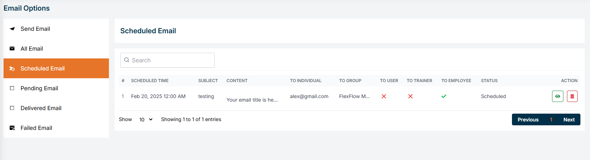

# Here is how can see Scheduled emails details !
- Click on the view button to see the details of the email that has been scheduled.

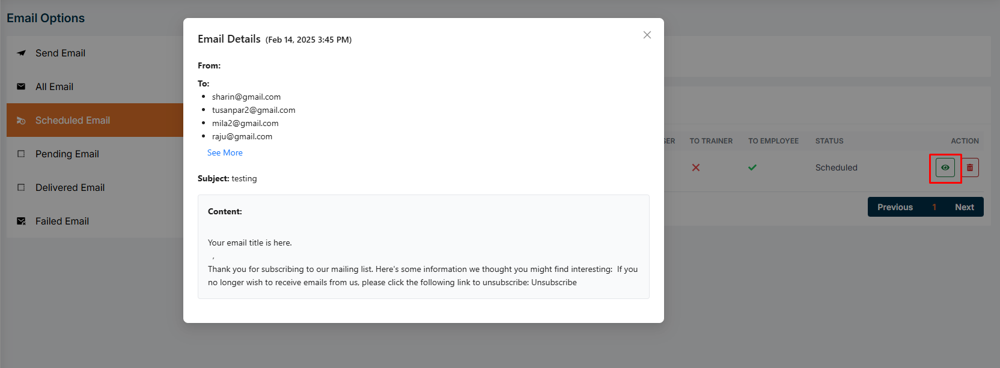

# Here is how to delete a scheduled email !
- Click on the delete button to delete the email that has been scheduled.

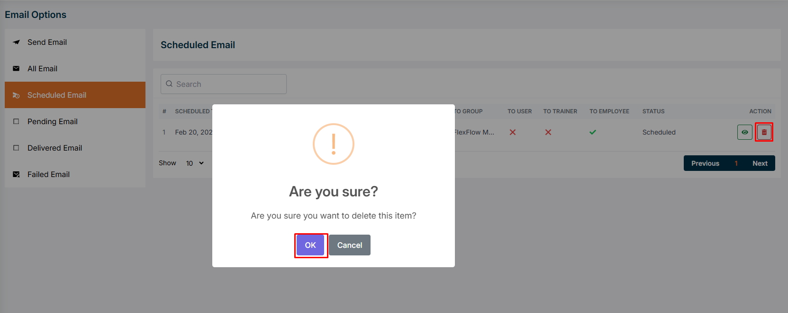

</TabItem>

<TabItem value="pending">

## Pending Email

- In this section, the admin can see the list of all emails that are pending to send to the members, trainers, marketing groups, employees and subscribers.

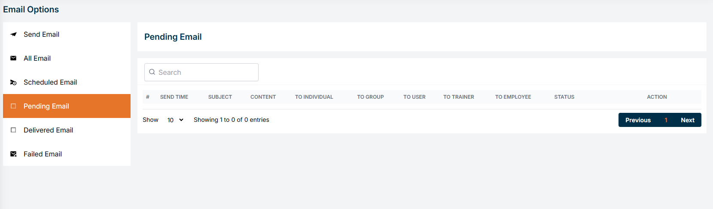

</TabItem>

<TabItem value="delivered">

## Delivered Email

# Here is how can Delivered Email list !

- In this section, the admin can see the list of all emails that have been delivered to the members, trainers, marketing groups, employees and subscribers.

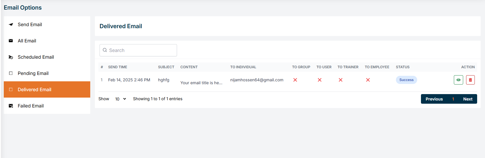

# Here is how can see Delivered Email details !

- Click on the view button to see the details of the email that has been delivered.

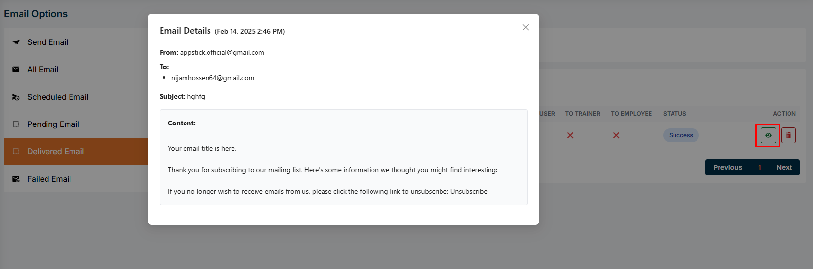

# Here is how to delete a delivered email !

- Click on the delete button to delete the email that has been delivered.

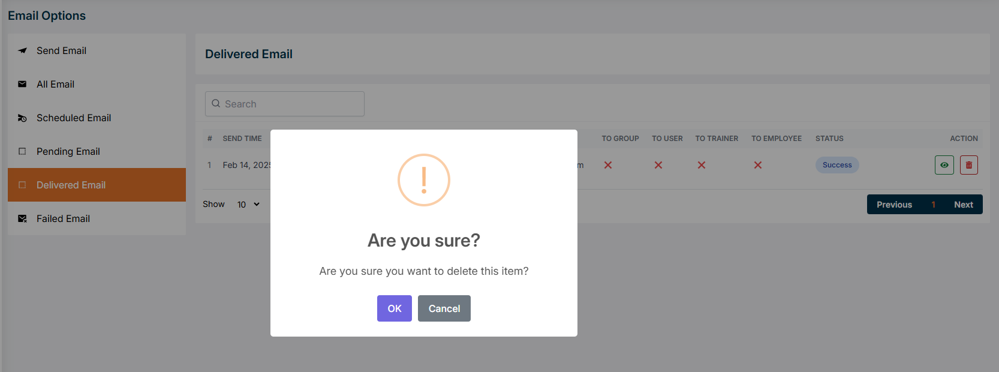

</TabItem>

<TabItem value="failed">

## Failed Email

# Here is how can see Failed Email details !

- Click on the view button to see the details of the email that has been failed.

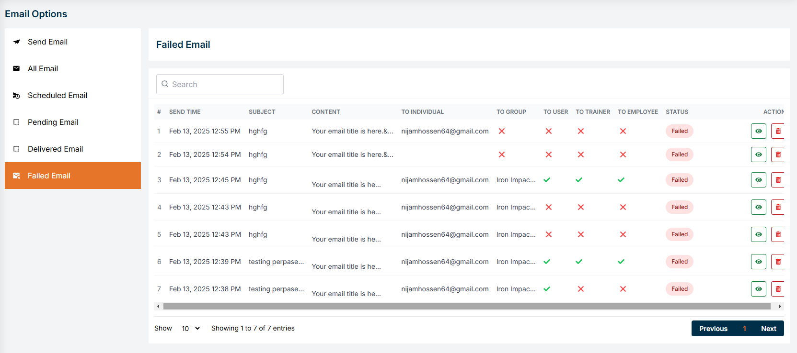

# Here is how to delete a failed email !

- Click on the delete button to delete the email that has been failed.

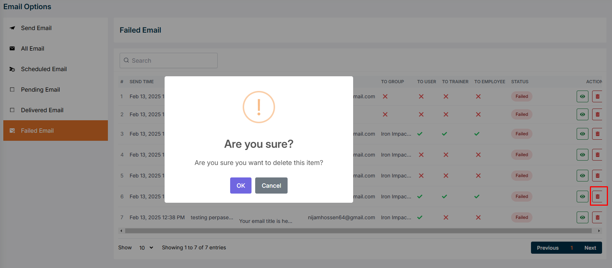

</TabItem>

</Tabs>