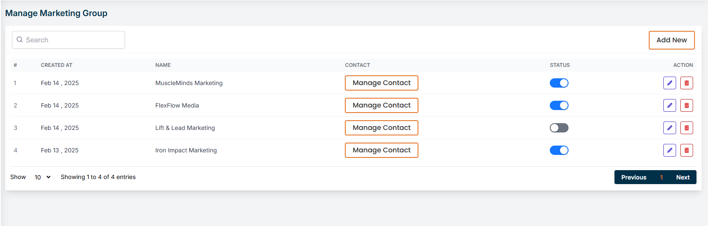
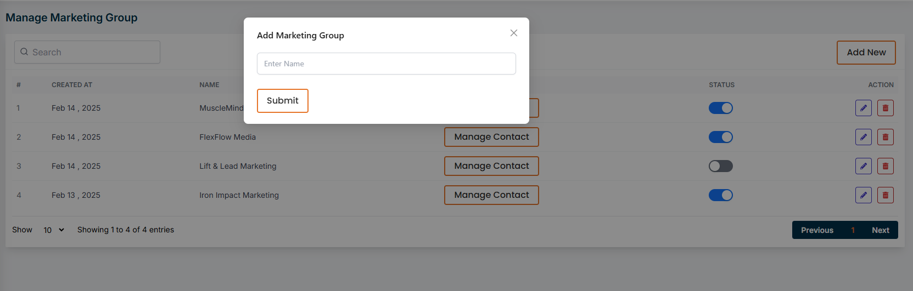
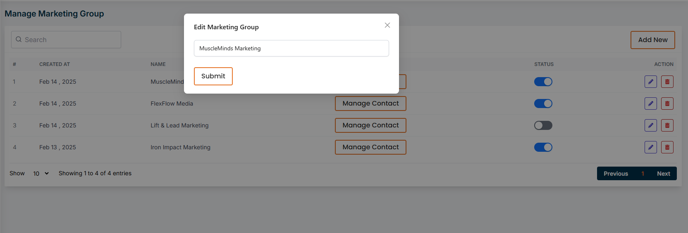
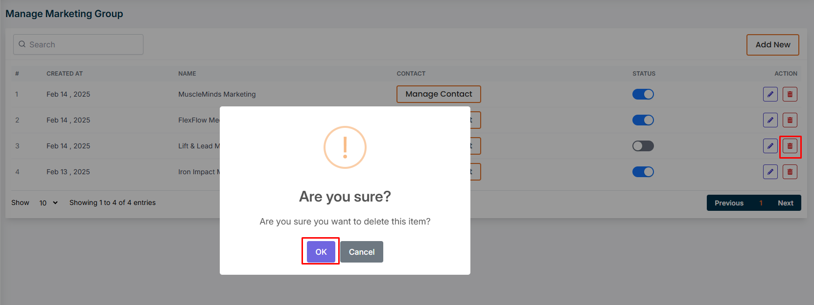
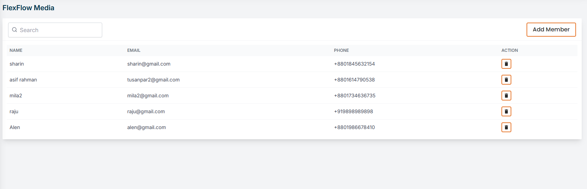
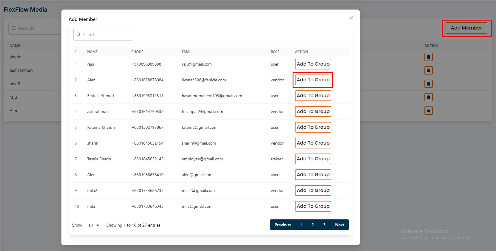
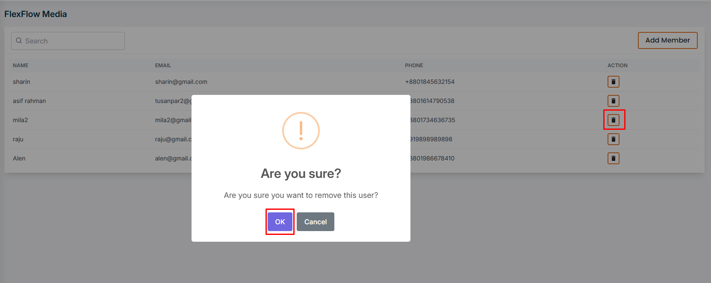

# Manage Group

- In this section, the admin can create groups focused on gym marketing.
- Admin will be able to see all the existing groups.
- Admin can search for a specific group by using the **search bar** .
- Admin can manage group by clicking the **Manage Group** button.

# Here is how to add a new group !
- To add a new group, click on the **Add New** button. A form will appear where you can add a new group.
- Fill in the required fields and click on the **Submit** button.

# Here is how to edit and delete a group !
- To edit a group, click on the **Edit** action button.
- A form will appear where you can change the required fields of the group and click on the **Submit** button to submit the group.

- To delete a group, click on the **Delete** action button.

# Here is how to add to group members !
- To add members to a group, click on the **Manage Contact** button.
- A page will appear where you can add members to the group by clicking the **Add Member** button.

# Here is how to remove group members !
- To remove members from a group, click on the **delete** action button.
- A confirmation message will appear, click on the **Yes** button to confirm the deletion.

