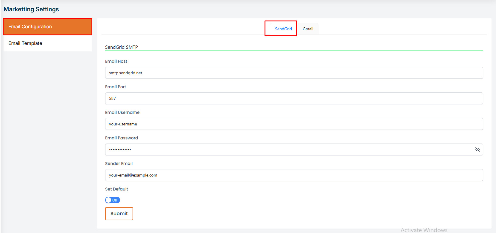
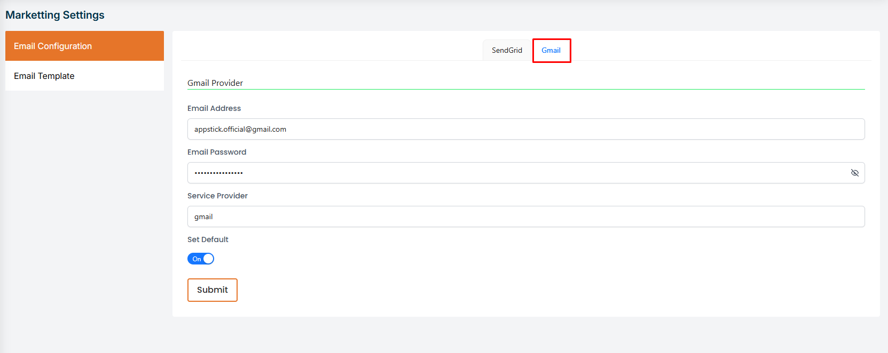
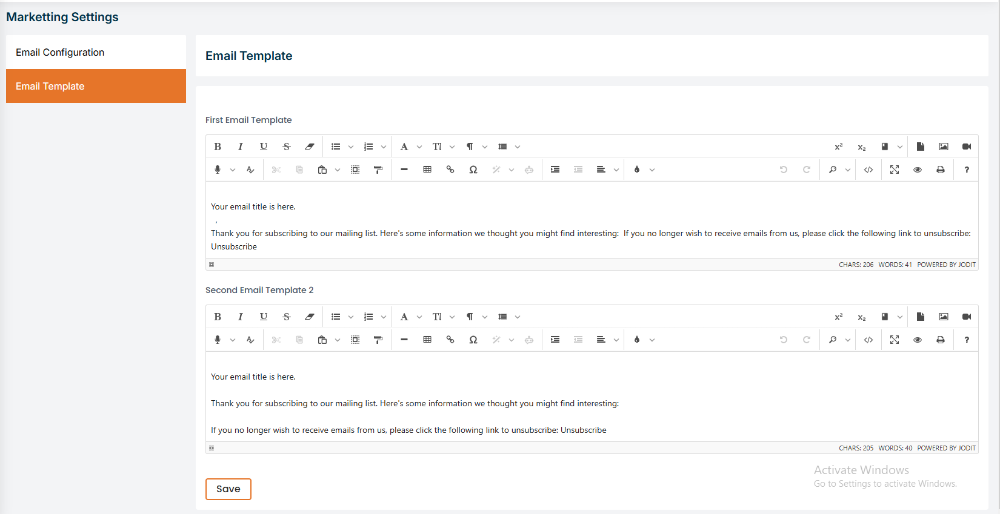

# Marketing Settings  

**In this section, the admin will be able to set the email settings , email template and SendGrid SMTP.**

import Tabs from '@theme/Tabs';
import TabItem from '@theme/TabItem';

<Tabs defaultValue="config" values={[
  {label: 'Email configaration', value: 'config'},
  {label: 'Email template', value: 'template'},
]}>

<TabItem value="config">

## Email configaration

# Here is how to set the email configuration !

- In this section, the admin will be able to set the email configuration.

- The admin will be able to set the email configuration like email address, email name, email host, email port, email username, email password, email encryption.

# Here is how to set the email template !

- In this section, the admin will be able to set the email template.
- The admin can set the email template how the email will be sent to the users.
- The admin can set only two email templates in here.

</TabItem>

<TabItem value="template">

## Email template

# Here is how to set the email template !

- In this section, the admin will be able to set the email template.

- The admin can set the email template how the email will be sent to the users.

- The admin can set only two email templates in here.

</TabItem>
</Tabs>