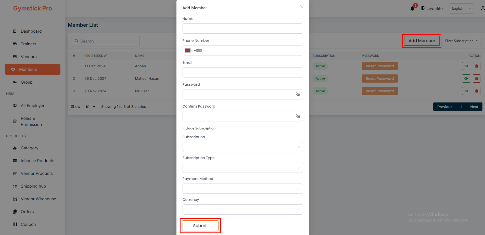
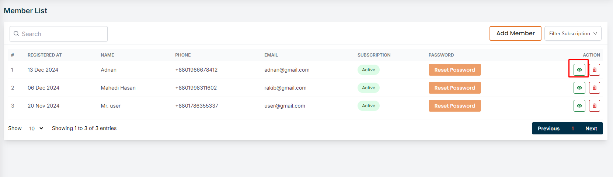
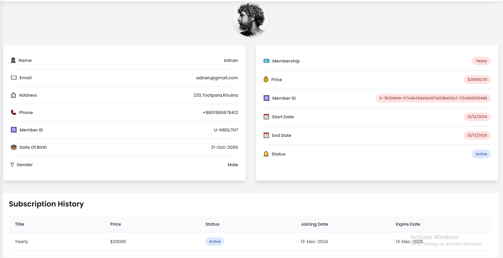
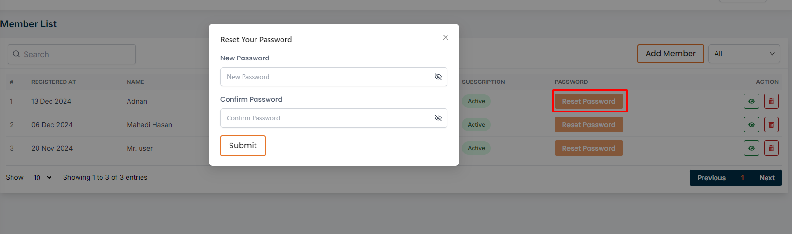
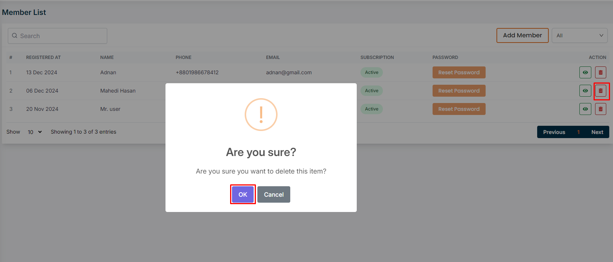

# Members

- In this section, the admin will be able to see all the existing users and their key information. Admin can search for a specific user by using the **search bar** and also can filter users based on their role using the **filter option**.

## Here is how to add a User !

- Select the **Add Member** button to open the registration form.
- Complete and submit the form to create a new user.

## Here is how to see User Details !

- To see the details of a user, click on the **View** button. A page will appear where you can see the details of the user.

- And you can also filter users based on their subscription using the **filter subscription**.

## Here is how you can reset user password !

- In this section, the admin will be able to reset user password by clicking the Reset Password action button.

## Here is how to delete any User !

- To clicking delete action button to delete an user .

