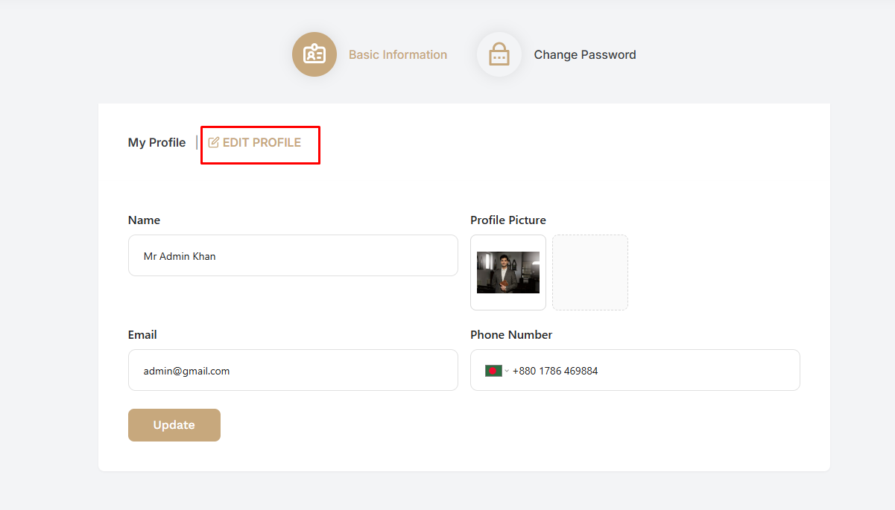

# Profile
- Clicking on **Profile**, admin will be able to see his profile details setting.

## Profile Details

- Admin can see his profile details like name, email and phone number.
- By clicking on **Edit Profile**, a form will be displayed where admin can edit his profile details and click on the **Update** button to save the changes.

## How to change admin password ?

- Admin can change his password by clicking on the **change password** button.
- A form will then be displayed where the admin can enter their current password, new password, and confirm the new password. 
- After entering the details, the admin can click on the **Change Password** button to save the changes.

