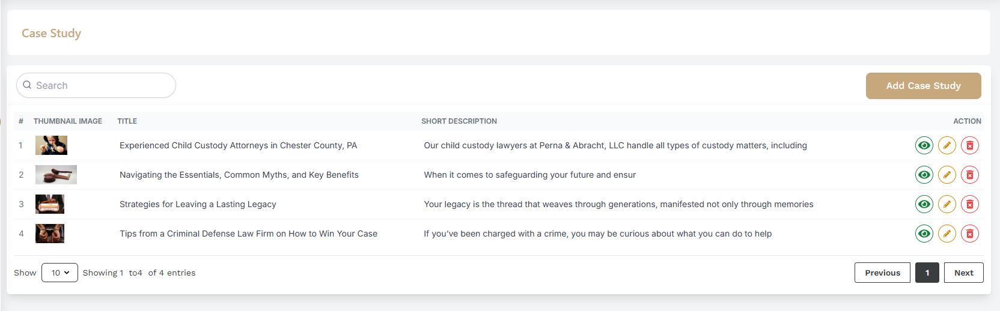
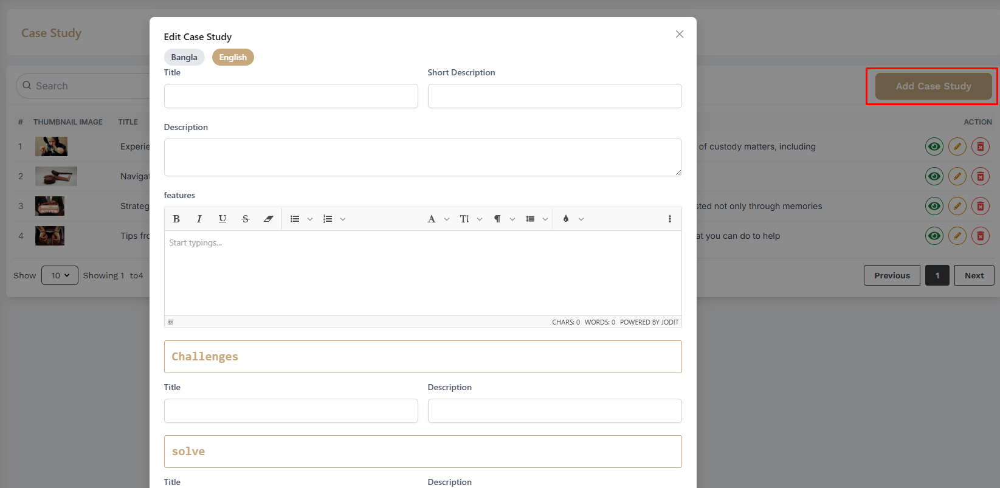

# Trainer

- In this section, the admin will be able to see all the existing trainers and Admin can search a specific trainer by using the **Search Bar**.

## Here is how you can add a trainer !
- In this section, the admin will be able to add trainers and by clicking the **Add Trainer** button, you can add a new trainer.

## Here is how you can see trainer details !

- In this section, the admin will be able to see all the existing trainer details by clicking the **View** action button.

## Here is how you can reset trainer password !

- In this section, the admin will be able to reset trainer password by clicking the **Reset Password** action button.

## Here is how you can delete trainer !

- In this section, the admin will be able to delete a specific trainer by clicking the **Delete** action button.

