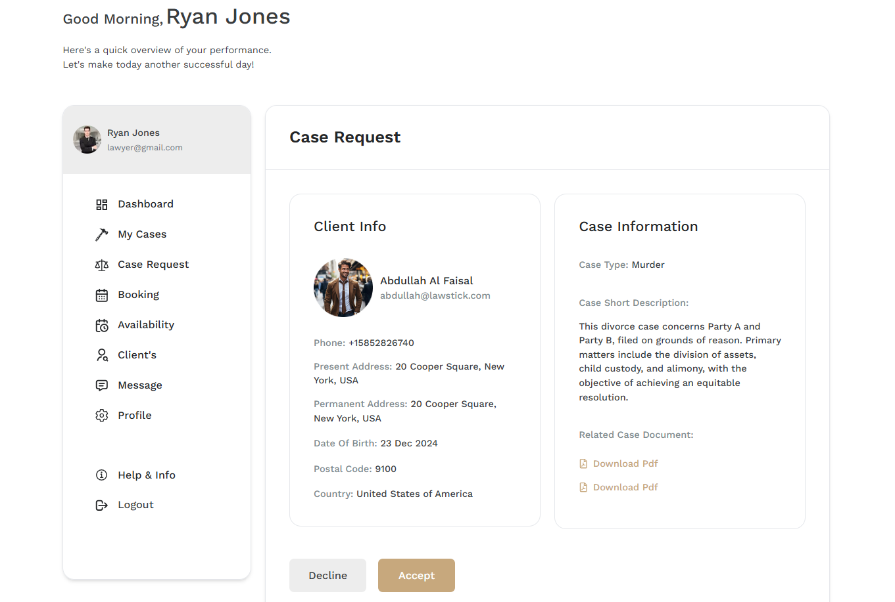

# Case Request

- In this section, the attorney will be able to see all case requests came from the clients .

- To clicking on the **View** action button, the attorney can see the client's case request information and evidences pdf files.

- clicking on the **Accept** button to accept the case request.

- clicking on the **Decline** button to reject the case request.

