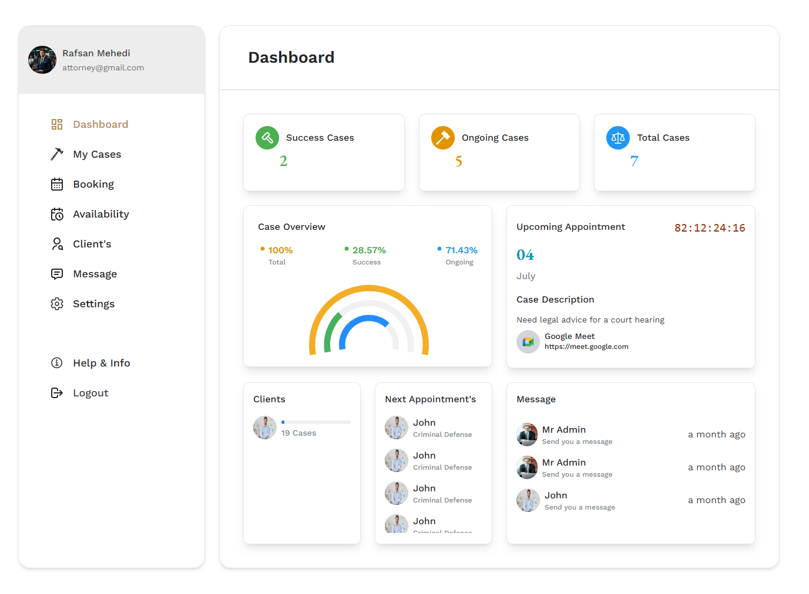

# Attorney Dashboard

The attorney Dashboard is the first page you see when you log in to your account. It gives you an overview of your account and allows you to navigate to different sections of the application.

- The dashboard contains the following sections:

  - **Dashboard**: This is the main page of the application, where you can see an overview of your account.

  - **Case Overview**: This section shows you all of your case overview.

  - **Messages**: This section allows you to receive messages from other users.

  - **Upcoming Appointments**: This section shows your upcoming appointments and that appointment google meet link.

  - **Appointment List**: This section attorneys can see their appointment list.