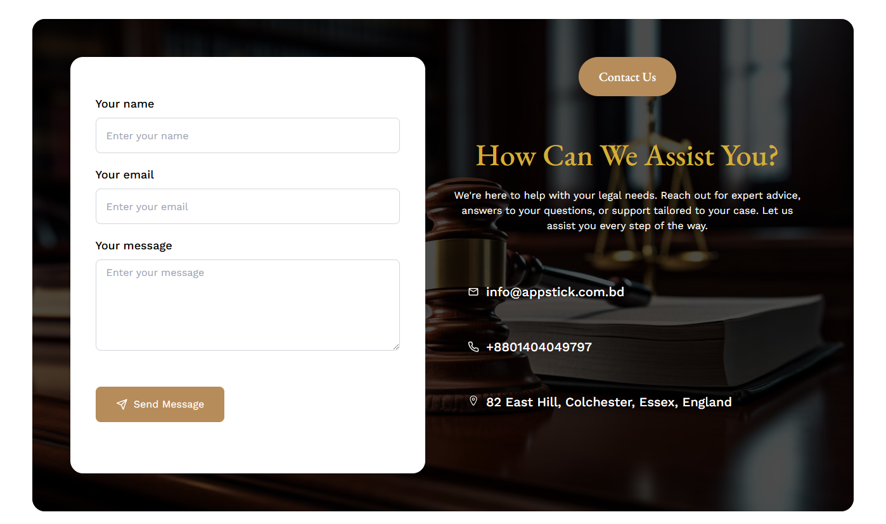
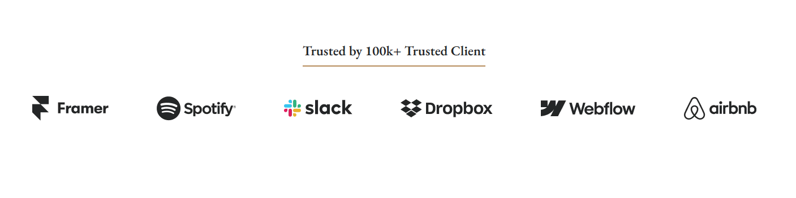

# About Us

- In this section, anyone can see the about us section photo and content, here all the sections are dynamic. You can change it according to your requirement.
- Based on the landing page's About section design, the About page design should be similar.

## Testimonial

- In this section, members can see the testimonial .

## Team

- In this section, uses can see all of the Trainers

## Contact

- In this section, anyone can see the contact section photo and content, here all the sections are dynamic.

- Admin can change it according to his requirement.
 

## Trusted  clients

- In this section, uses can see all of the Clients

- Admin can change it according to his requirement.

