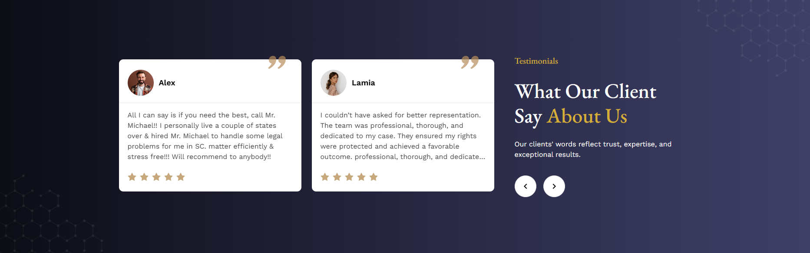

# Home 

## Hero Section
- In this section, uses can see the hero section with photo and content, here all the sections are dynamic.
- Admin can change it according to his requirement.
- To clicking the **Get Appointment** button have two behaviour, if user is Unauthenticated then it is redirected to the sign-in modal and if user is Authenticated then it is redirected to the attorney page to make an appointment.

## About Us
- In this section, users can see the about us section with photo and content, here all the sections are dynamic.
- Admin can change it according to his requirement.
- To clicking the **Read More** button to go to the about page and see all about us.

## Services

- In this section, uses can see the services section photo and content, here all the sections are dynamic.
- Admin can change it according to your requirement.
- To clicking the service name or arrow icon to go to the Service detail page.
- To clicking the **All Service** button to go to the services page and see all services.

## Testimonial

- In this section, members can see the testimonial .

## Team

- In this section, uses can see all of the Trainers

## case study

- In this section, uses can see all of the Case Studies
- Clicking the case study name or **Read More** button to go to the Case Study details page.
- Admin can change it according to your requirement.

<!--  -->

## FAQ
- In this section, anyone can see the FAQ section, here all the sections are dynamic.

- Admin can change it according to his requirement.

## Contact

- In this section, anyone can see the contact section photo and content, here all the sections are dynamic.

- Admin can change it according to his requirement.
 

## Blog
- In this section, uses can see all of the Blogs
- Clicking the blog name button to go to the Blog details page.

<!--  -->

