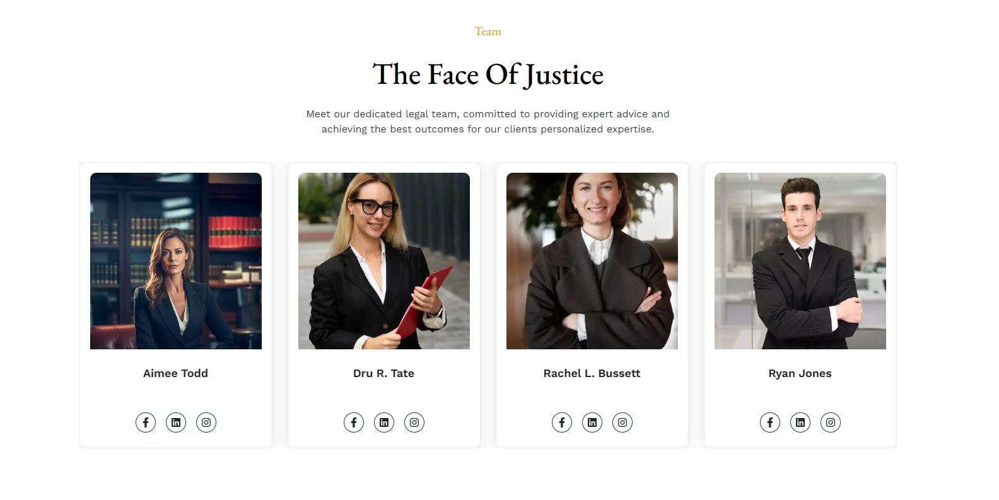

# Home 1

## Hero Section
- In this section, uses can see the hero section with video and content, here all the sections are dynamic.
- Admin can change it according to his requirement.
- To clicking the **Start your journey** button to go to the services page and see all services.
- To clicking the **Contact Us** button to go to the contact page and you can contact with us.

## About Us
- In this section, users can see the about us section with photo and content, here all the sections are dynamic.
- Admin can change it according to his requirement.
- To clicking the **service** button to go to the services page and see all services.

## Services

- In this section, uses can see the services section photo and content, here all the sections are dynamic.
- Admin can change it according to your requirement.
- To clicking the service name to go to the Service detail page.
- To clicking the **All Service** button to go to the services page and see all services.

## BMI
- In this section, in here uses can calculate their BMI according to their height, age and weight.

## Class Schedule

- In this section, uses can see the class schedule , here all the sections are dynamic.

- Admin can change it according to his requirement.

## Pricing Plan

- In this section, uses can see the pricing plan section , here all the sections are dynamic.
- Admin can change it according to his requirement.
- To clicking the Get Started button if user is Unauthenticated then it is redirected to the sign-in page.
- To clicking the Get Started button if user is Authenticated and role is trainer or admin then it will show As a trainer or admin, you do not need to buy a subscription.
- To clicking the Get Started button if user is Authenticated and role is user then it is redirected to the subscription page.

## Testimonial

- In this section, members can see the testimonial .

## Team

- In this section, uses can see all of the Trainers

## Shop
- In this section, anyone can see the shop section with all the products, here all the sections are dynamic.

## Blog
- In this section, uses can see all of the Blogs
- Clicking the blog name button to go to the Blog details page.

