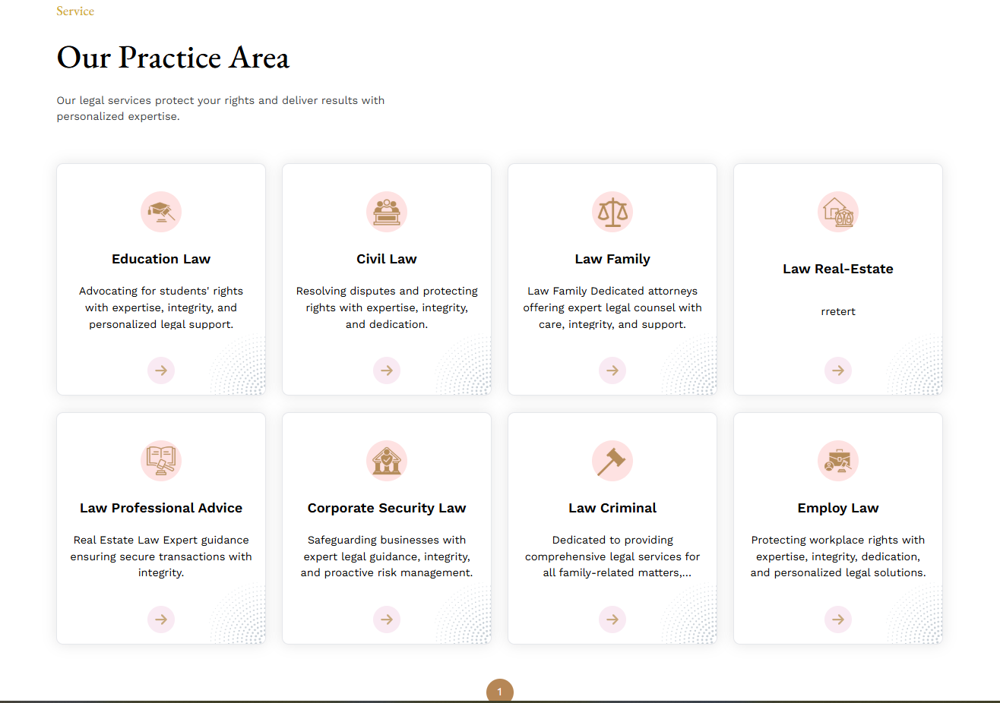
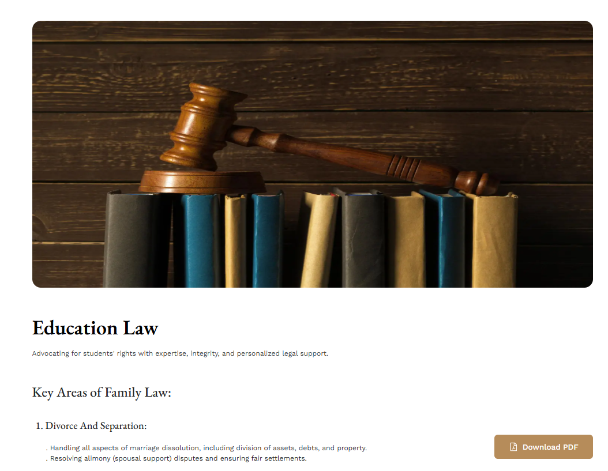

# Services

- In this section, anyone can see all services, here all the sections are dynamic. admin can change it according to his requirement.

- To clicking the arrow icon to go to the Services details page.

- Based on the landing page's service section design, the services page design should be similar.

# how to see a Service detail?

- clicking on the service image you can see the service detail.

## Trusted  clients

- In this section, uses can see all of the Clients

- Admin can change it according to his requirement.

## Contact

- In this section, anyone can see the contact section photo and content, here all the sections are dynamic.

- Admin can change it according to his requirement.
 

## Team

- In this section, uses can see all of the Trainers

