# Shop

- In this section, anyone can see the shop section with all the products, here all the sections are dynamic.

- You can all the products and filter them according to your requirement.

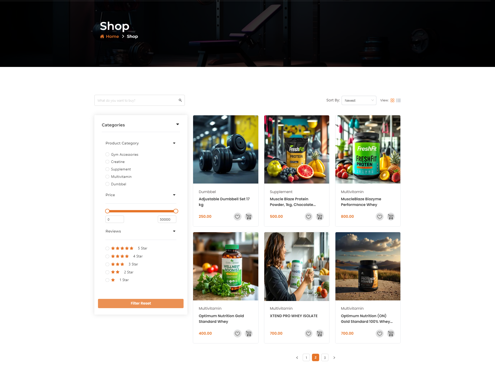

## Filter

- In the left side you can filter product beas on review ,price and category .
- Clicking on **Filter Reset** button you can reset all filter setting .
- You can search product by useing **search ber**.

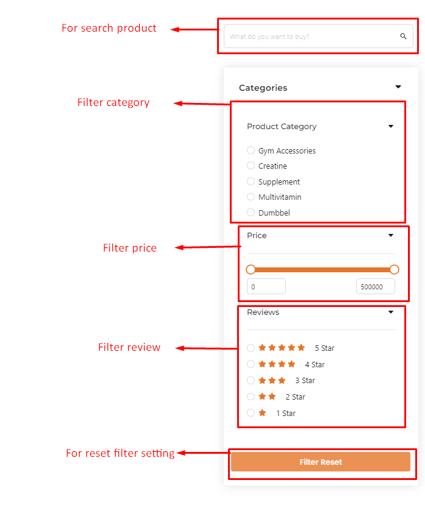

## Sort product

- You can sort product by useing sorting drop down .
- you can change view layout by useing view layout action icon .

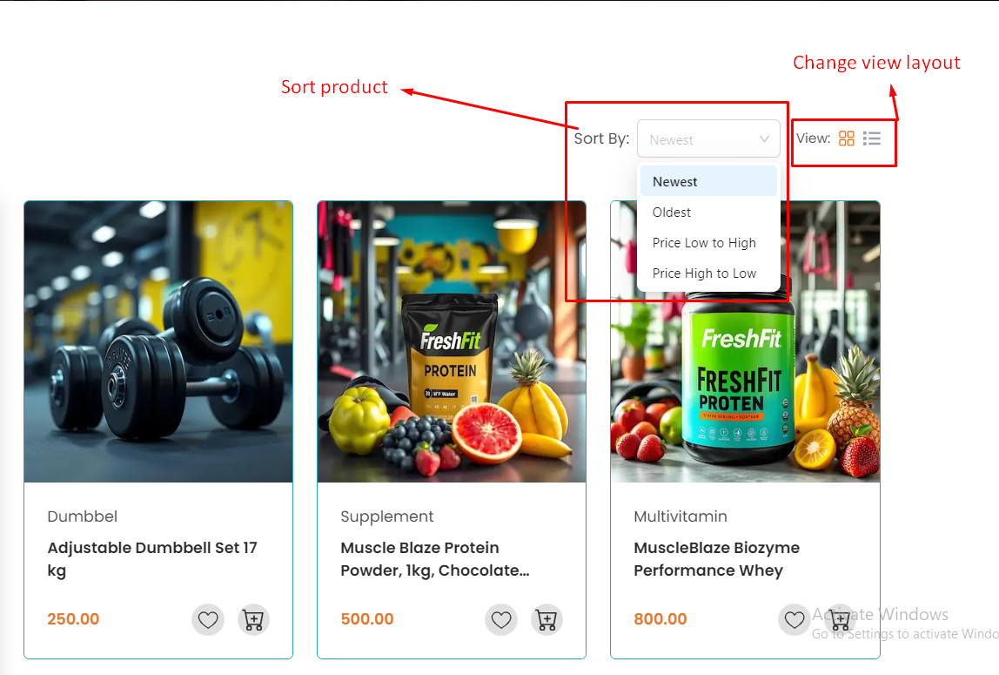

## Here is how to add product wishlist and cart 

- Clicking on wishlist action icon to add wishlist .
- Clicking on cart action icon to add cart list .

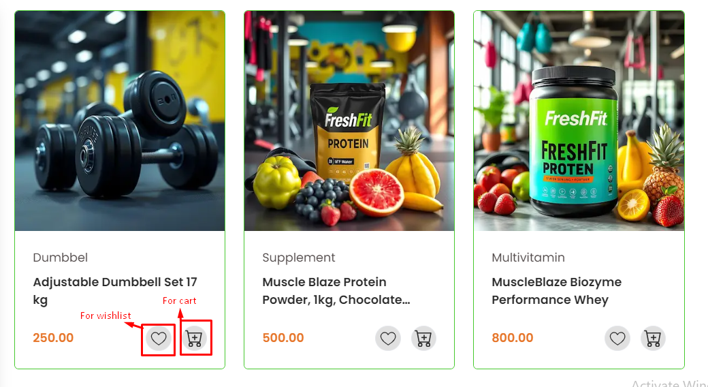

## Here is how to see a product detail

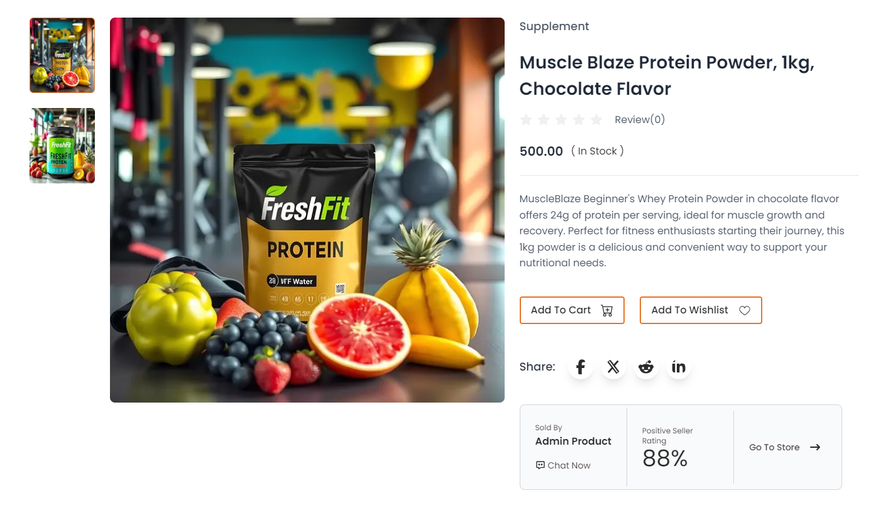

- clicking on the product image you can see the product detail.
- Clicking the **Add to Cart** button to add product to cart page.
- Clicking the **Add to Wishlist** button to add product to wishlist.
- You can also see which vendor is selling this product or selling product by admin.
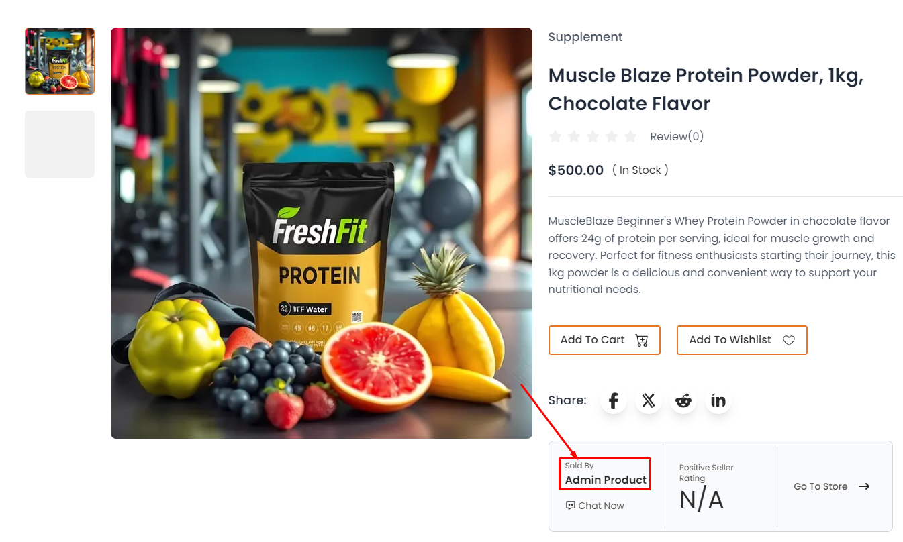

- You can also directly chat with vendor by clicking on **chat now** .

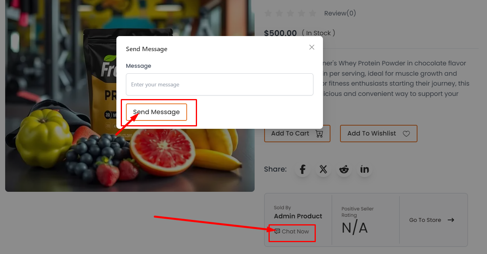

- If the product is selled by vendor then you can get that store coupon code downside of the product.

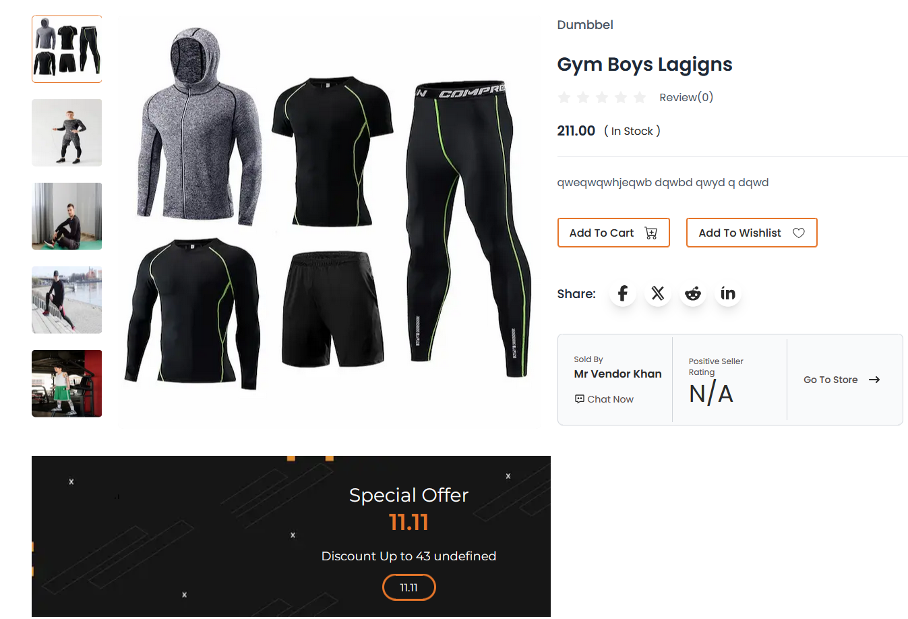

## Here is how you can see product store 

- In this section you can see product of that store .
- if that store is vendor you can get that store coupon code that created by store owner.

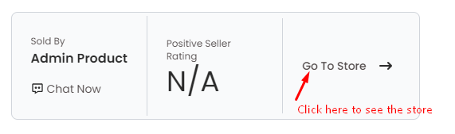

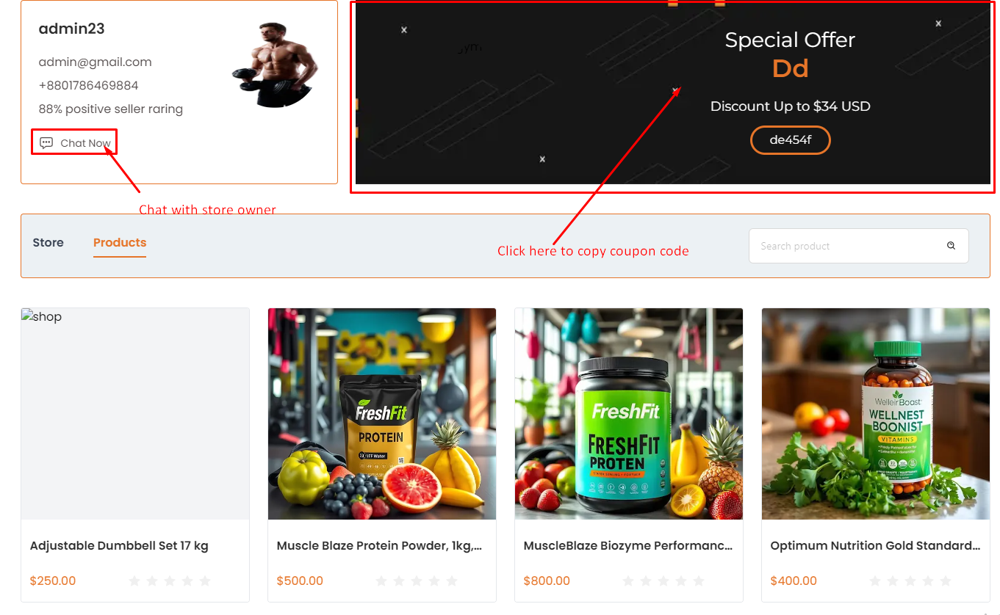

## Here is how you you can see product review and description 

- In this section you can see product Description .

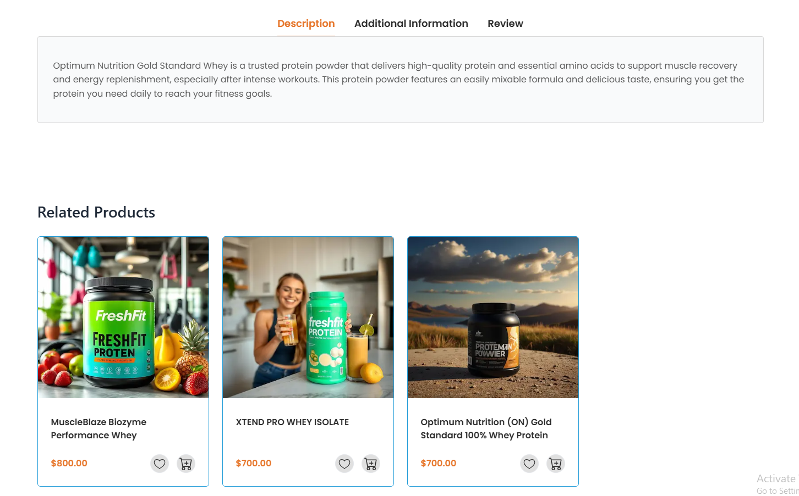

- In this section you can give product review if you purched .

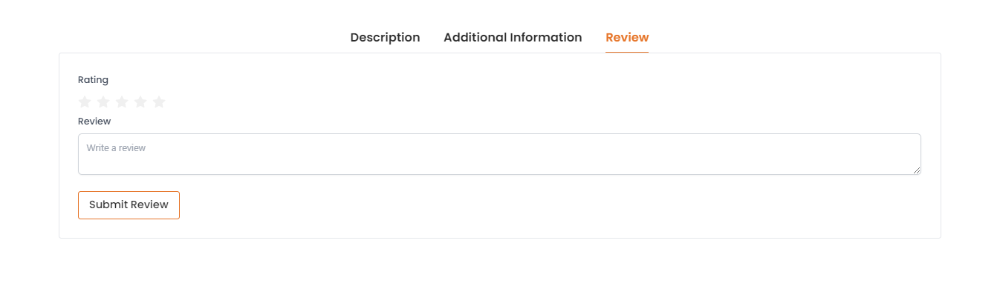

## Here is how you can see product store 

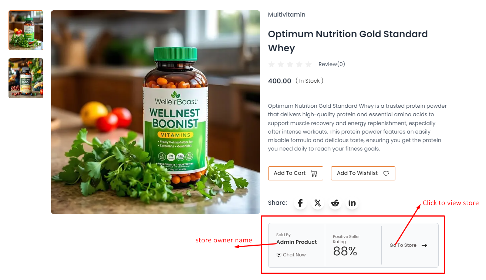

- clicking on go to store you can see store all product. 
<!-- image -->
