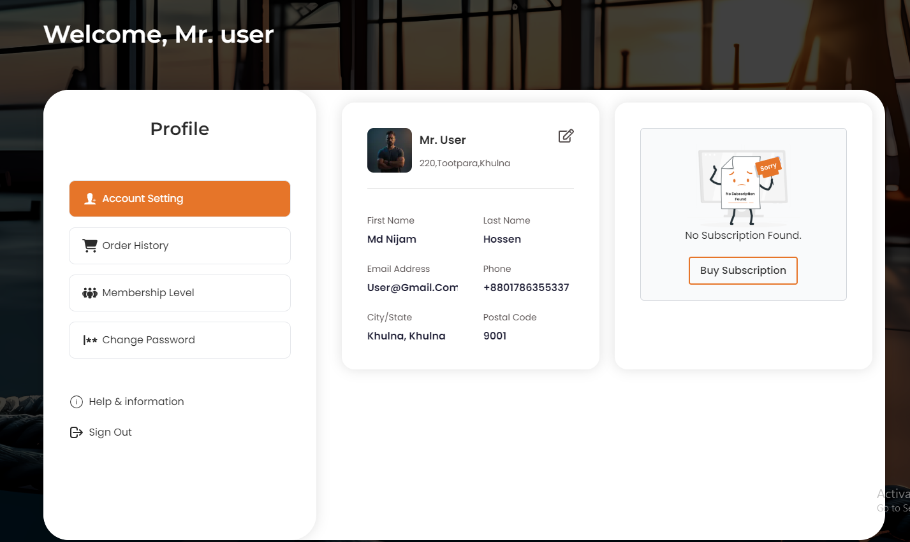
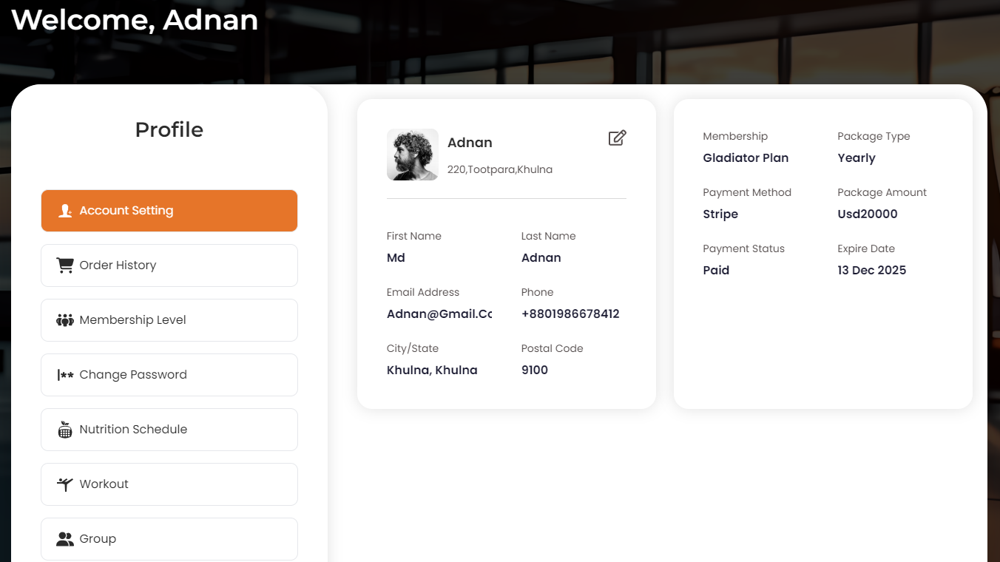

# Account settings 

- After purchasing a subscription, your profile will clearly display your personal information and membership details.

The **Account Setting** section allows users to manage their personal information, membership details, and access various functionalities related to their account. This section is crucial for maintaining up-to-date contact information, ensuring the security of the account, and managing membership details.

## Personal Information:

- Users can upload or change their profile picture, view their first and last name, email address, and phone number.
- Displays the user's address, including city/state and postal code.

## Membership Details

- Displays the current membership plan (e.g., Gladiator Plan) and package type (yearly, monthly, etc.).
- Shows the payment method (e.g., Stripe), package amount, payment status, and expiry date of the membership.