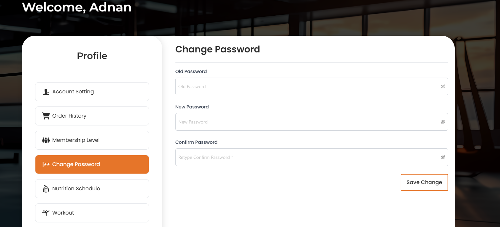

# Change Password

- The **Change Password** section allows users to change their password.

- Users can change their password by entering the old password and then current password and the new password.

- After entering all required feilds, users can click the **Save Change** button to set the new password.

