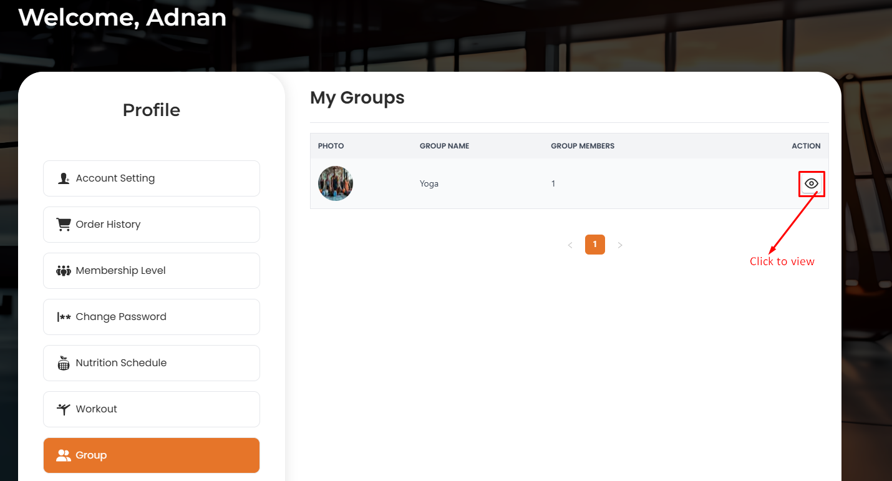
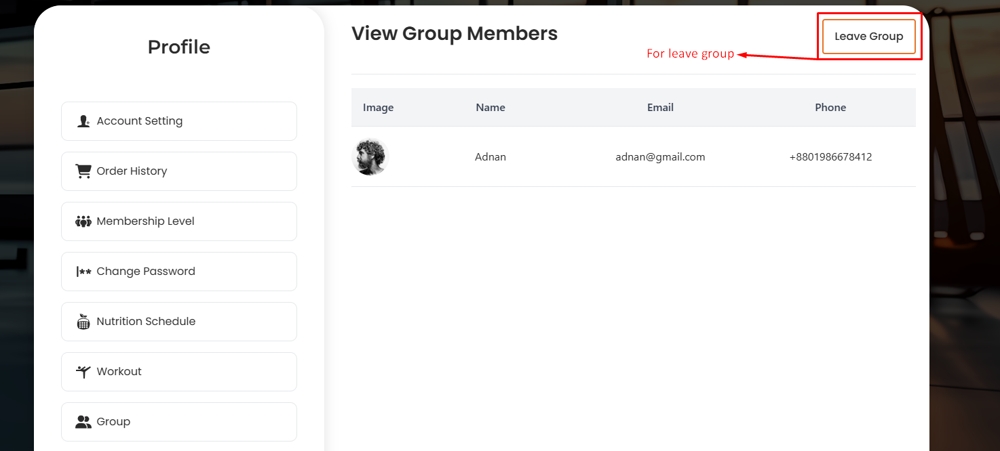
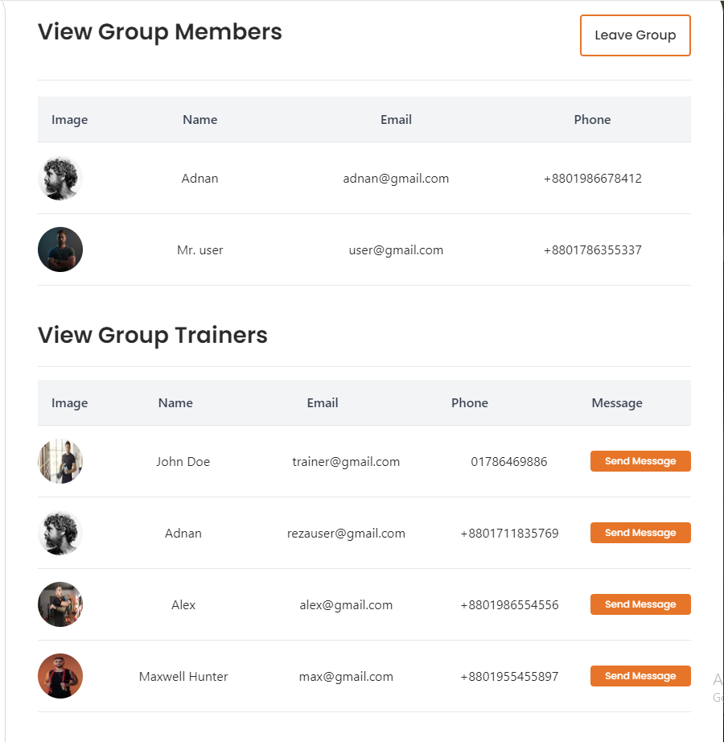
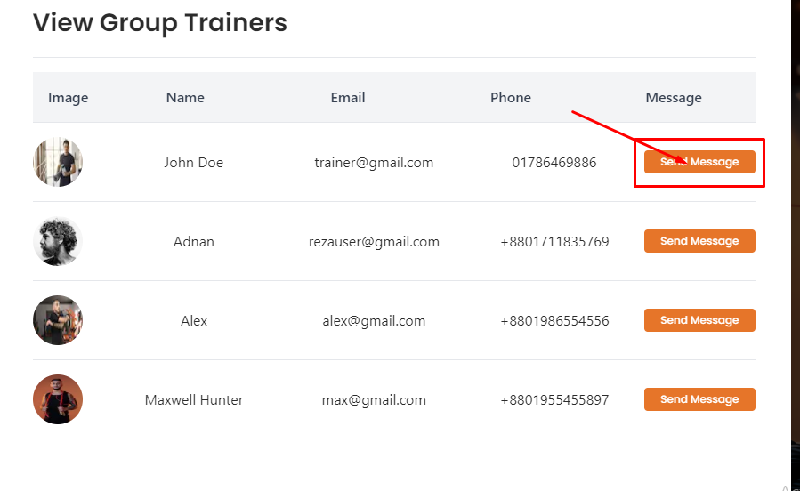
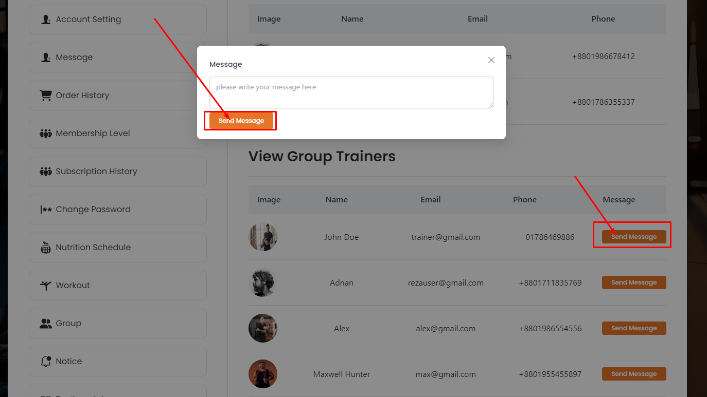

# Group

- The **Group** section allows users to see all groups that user has joined.

- To join a group, users need to purchase a membership plan.

- By clicking on the **View** action button user will be able to see the group members

## Here is how to leave a group !

- Top right corner of the page user will see the **leave Group** button by clicking on the button user will be able to leave the group.

## Here is how you can see all group members and there trainer !

- After clicking on group **view** action button user will be able to see the group members

## Here is how you can message trainer !

- After clicking on **send message** button user will be able to send message to trainer.

- After clicking on **send message** button user will redirect to the message page.