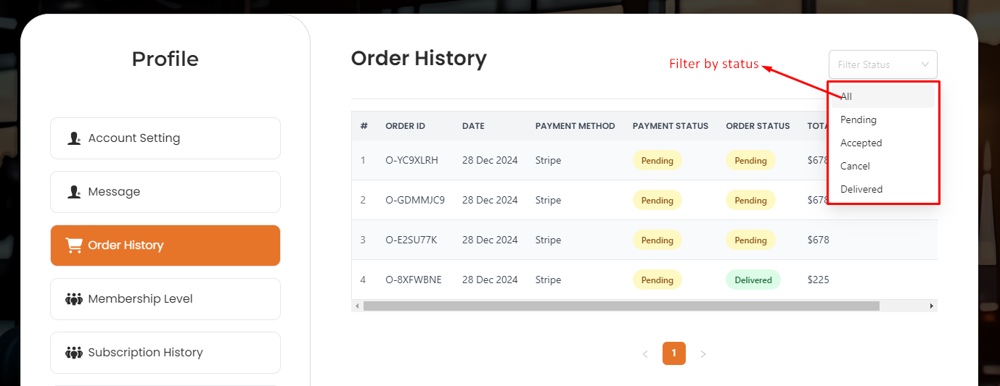
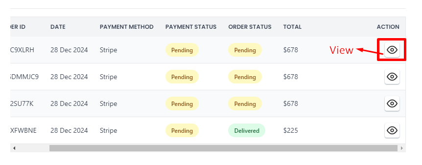
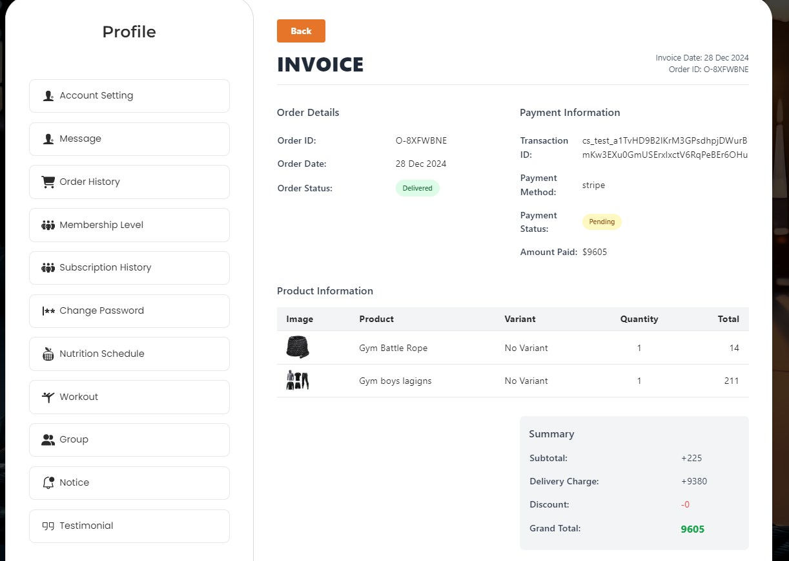

# Order History

- The **Order History** section allows users to view their order history. 
- User can filter orders based on their status using the **filter status** option.

# Here is how to view order details!

- After clicking on the order **view** action button, the user will be able to see the order details.

