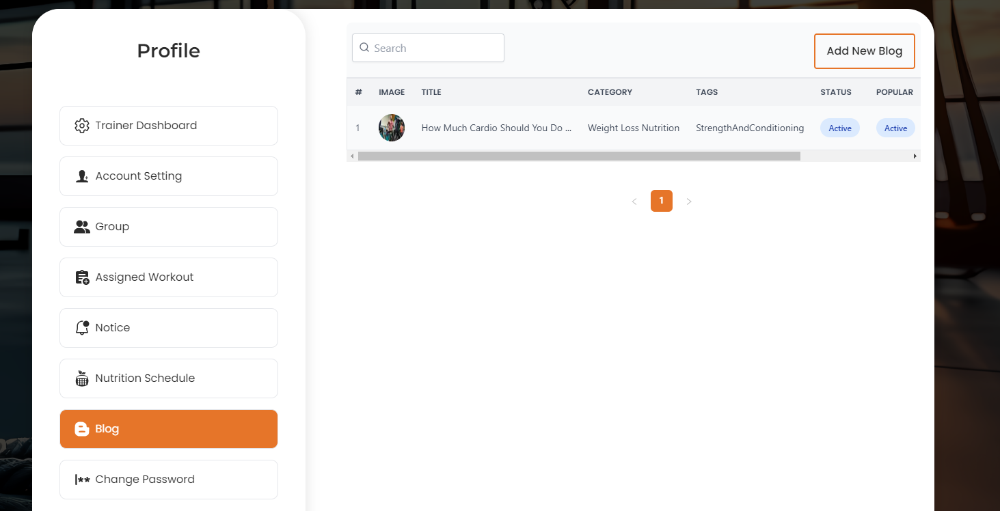
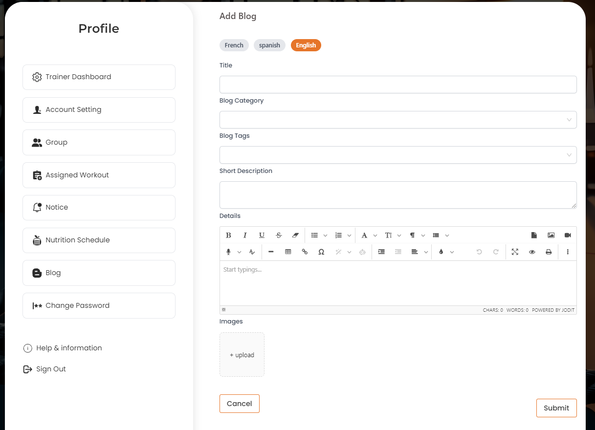
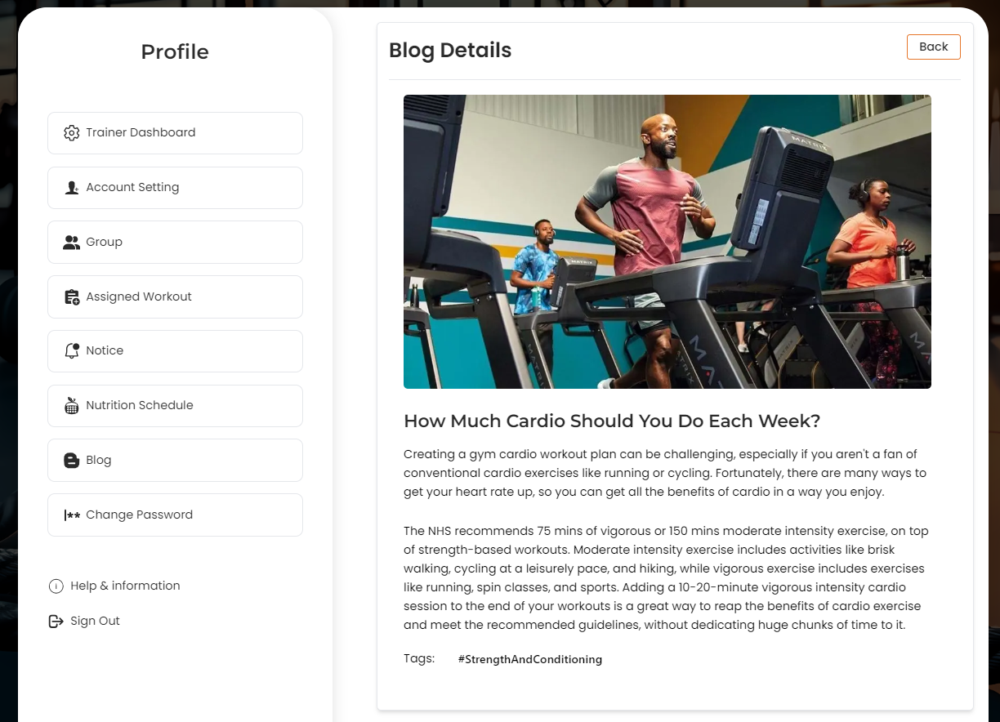
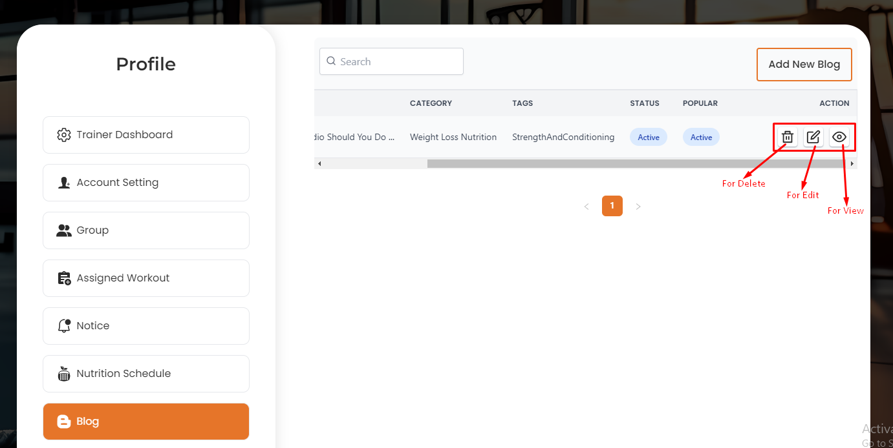

# Blog

- In this section, the trainer can create blog posts for the site.

- In this section, the trainer will be able to see all the existing blogs.

- Trainer will be able to search the blog by using the **search bar**.

<!-- image -->
# Here is how to add a new blog !

- To add a new blog, click on the **Add New** button.

- A form will appear where you can add a new blog. After adding the blog, click on the **Submit** button to Submit the blog.

# Here is how to view a blog detail !

- To view a blog detail, click on the **View** action button.

- A form will appear where you can view the blog detail.

# Here is how to edit and delete a blog !

- To edit a blog, click on the **Edit** action button. A form will appear where you can edit the blog. After editing the blog, click on the **Submit** button to Submit the blog.

- To delete a blog, click on the **Delete** action button.

