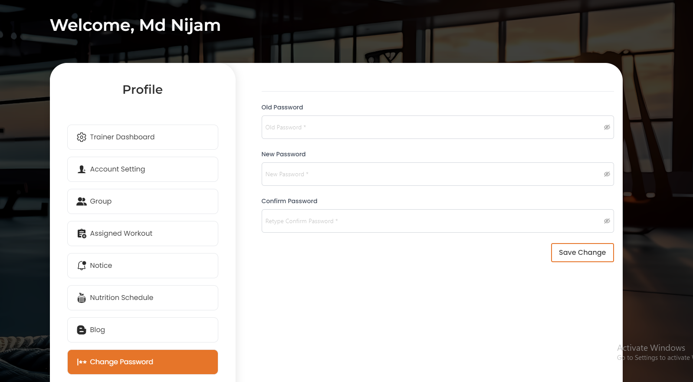

# Change Password

- The **Change Password** section allows trainers to change their password.

- Trainers can change their password by entering the old password and then current password and the new password.

- After entering all required feilds, trainers can click the **Save Change** button to set the new password.

