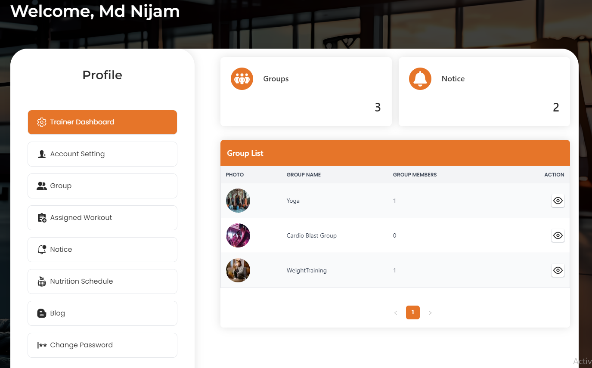

# Trainer Dashboard

The Trainer Dashboard provides comprehensive tools for trainers to :

## Manage Groups 

- View and manage assigned groups, including group details and members.

- Assign and manage workouts for each group.

## Notices 

- Send timely updates and important announcements to group and  members.

# To access features in the Trainer Dashboard :

 1 . Log in with trainer credentials.

 2 . Navigate through the dashboard to manage account settings, assigned groups, workouts, notices, and blog posts.
