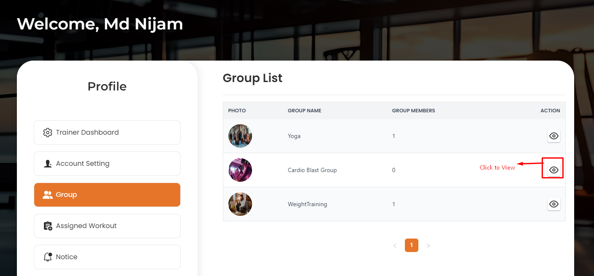
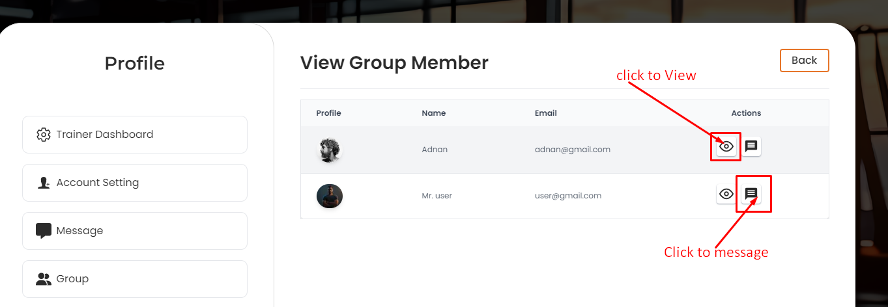
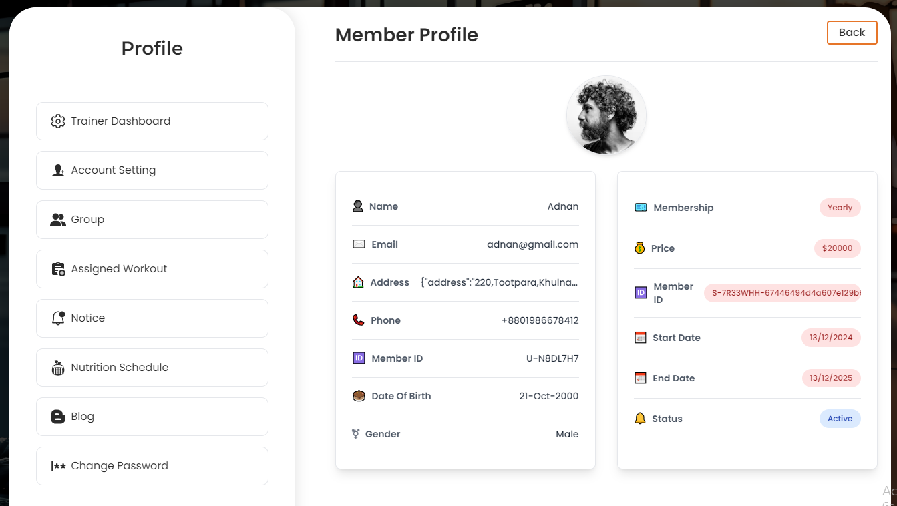
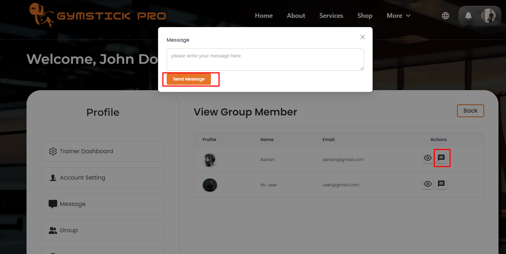

# Groups

- In this section, the trainer will be able to see all the existing groups that admin has assigned.

- Trainer can **view** the group and by clicking view action button and trainer will be able to see the group members table.

## Here is how you can see group members !

- By clicking **view** action button, trainer will be able to see the group members details.

- By clicking **Message** action button, trainer will be able to send message to group members.

