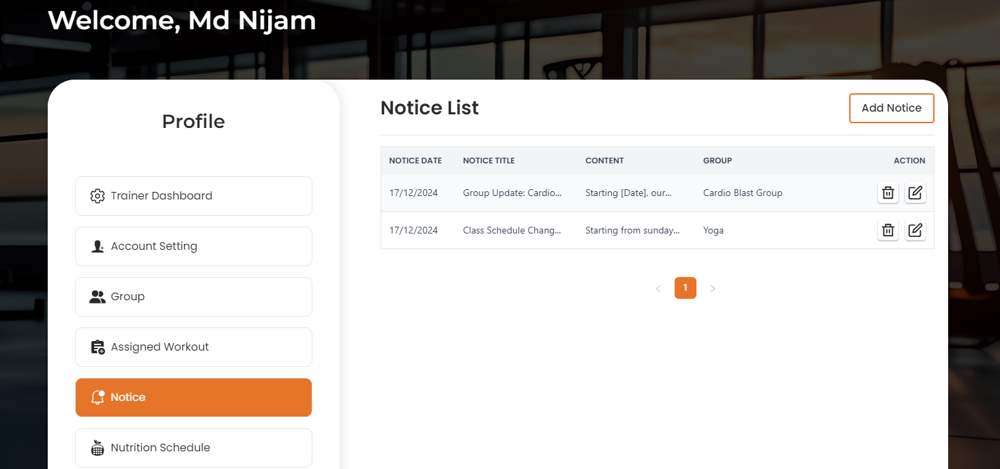
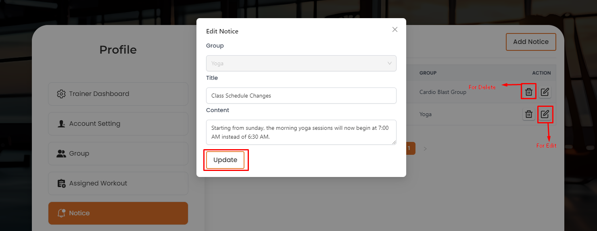

# Notices

- The Notice section allows trainers to send important updates and information to groups.

- Trainers can create and send notices to groups, ensuring that all members receive the necessary information.

# Here is how to send a notice!

- To send a notice, click on the Add Notice button. A form will appear where you can select the group, title, and write the conten. to click on the Submit button to Submit the notice.

# Here is how to edit and delete a notice!

- To edit and delete a notice, click on the Action buttons.

