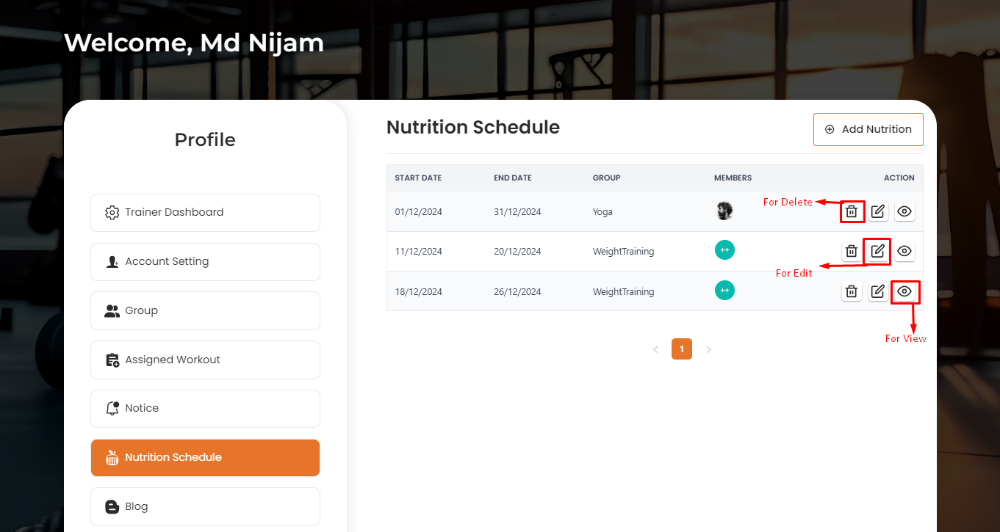
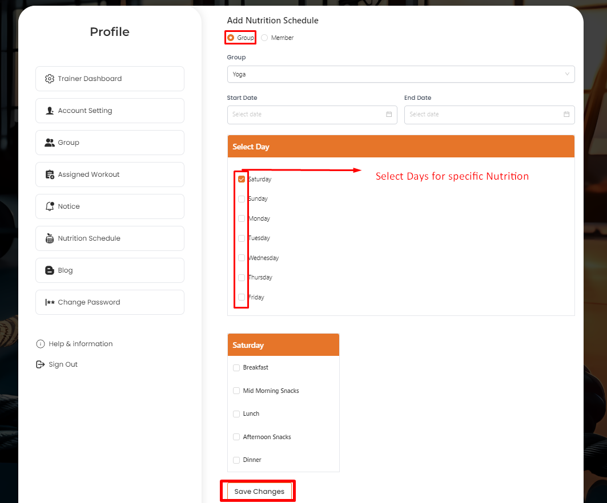
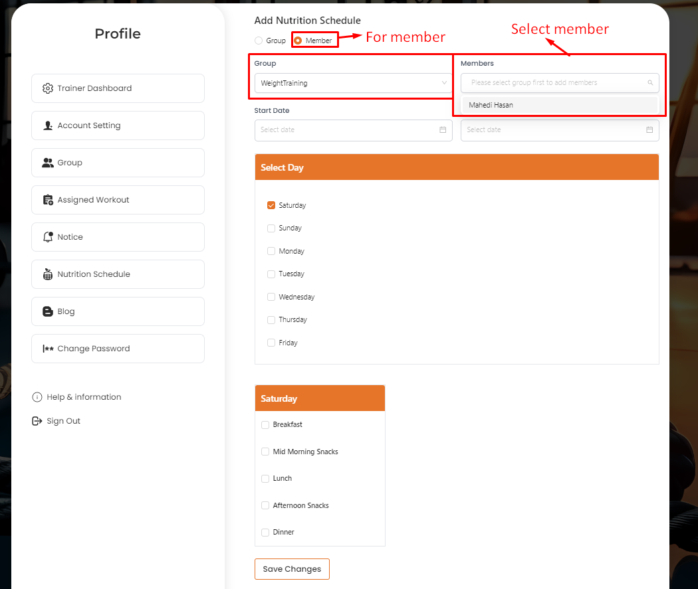
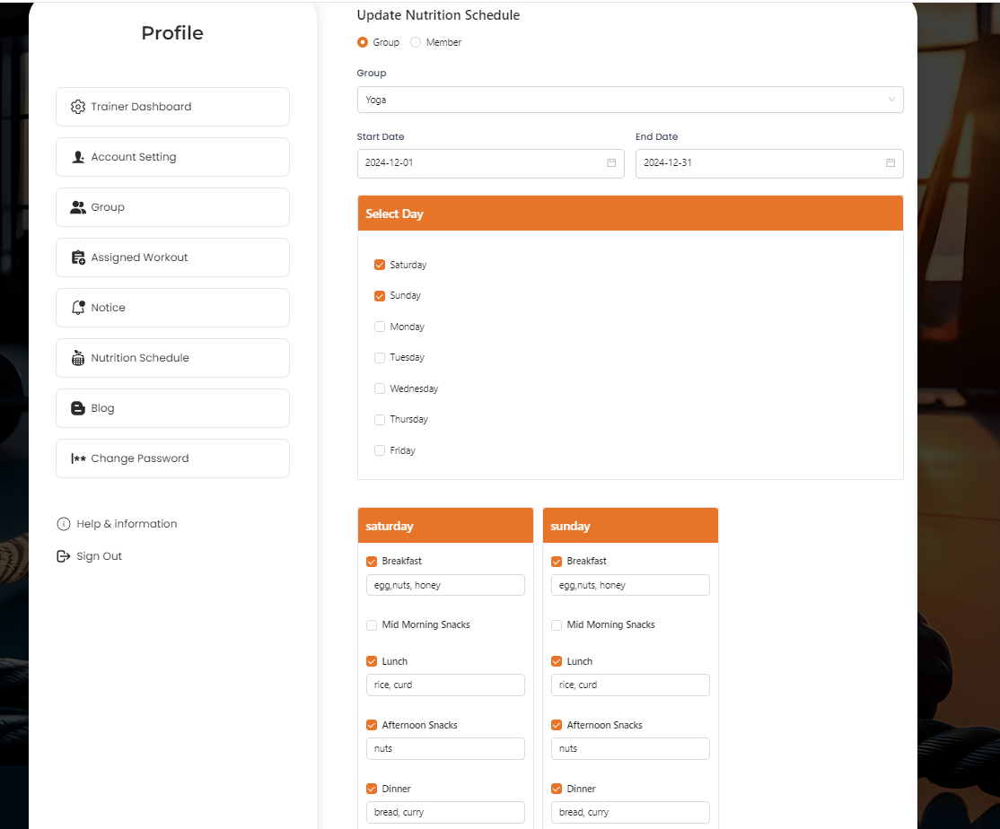

# Nutrition Schedule

- The Nutrition Schedule section allows trainers to assign nutrition schedules to groups.

- To add a new assigned nutrition schedule trainer can assign a new nutrition schedule to a specific **Group** or specific group with multiple **User**.

# Here is how to add assigned nutrition schedule !

- In this section, the trainer will be able to add the assigned nutrition schedule by clicking the **Add Nutrition** button and fill the required details and click the **Save Changes** button to save the assigned nutrition schedule.

# Here is how to edit and delete an assigned nutrition schedule !

- In this section, the trainer will be able to edit the assigned nutrition schedule by clicking the **Edit** action button and fill the required details and click the **Save Changes** button to save the assigned nutrition schedule.

- To delete the assigned nutrition schedule by clicking the **Delete** action button.