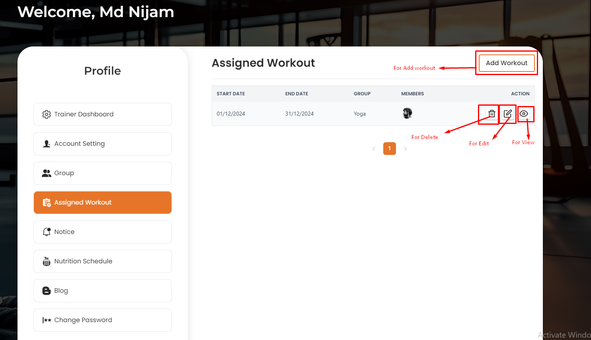
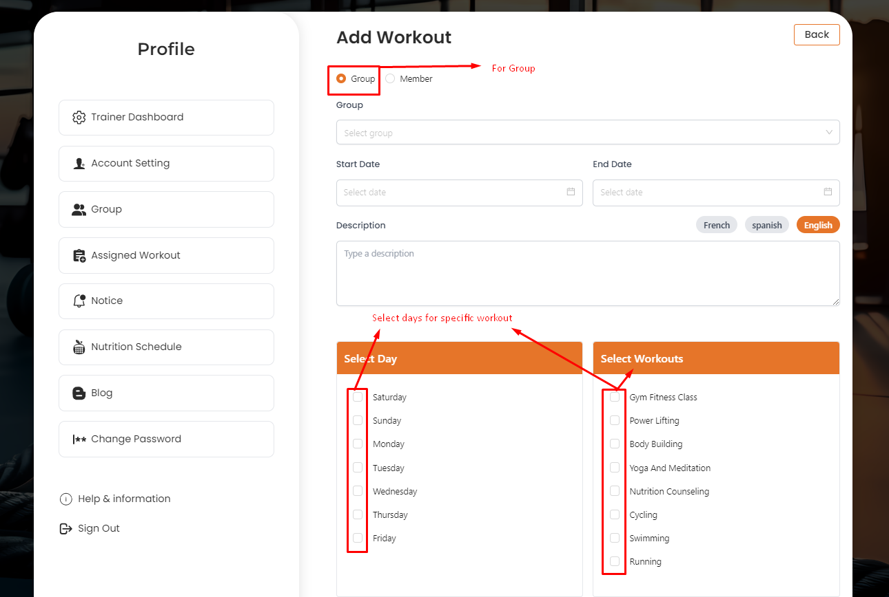
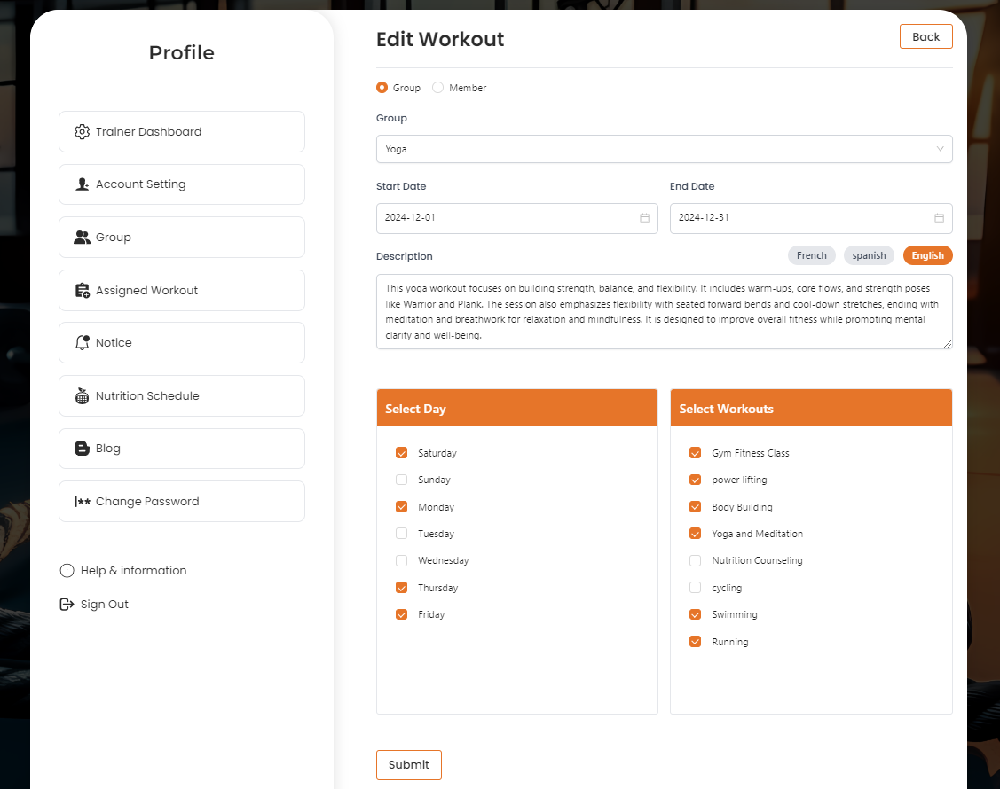

# Assigned Workouts

- Trainer can assign a new workout to a spapacific **Group** or spapacific group multiple with user.

- In this section, the trainer will be able to see all the assigned workout list .

## Here is how to add assigned workout !

- In this section, the trainer will be able to add the assigned workout by clicking the **Add Workout** button and fill the required details and click the **Submit** button to save the assigned workout.

## Here is how to edit and delete assigned workout !

- In this section, the trainer will be able to edit the assigned workout by clicking the **Edit** action button and fill the required details and click the **Save** button to save the assigned workout.

- In this section, the trainer will be able to delete the assigned workout by clicking the **Delete** action button.