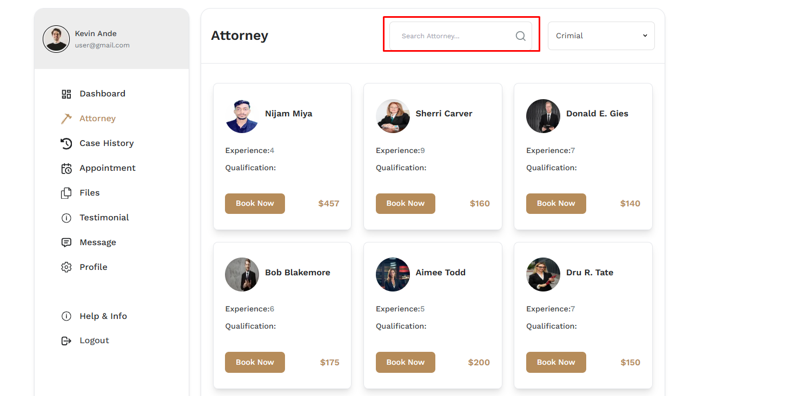
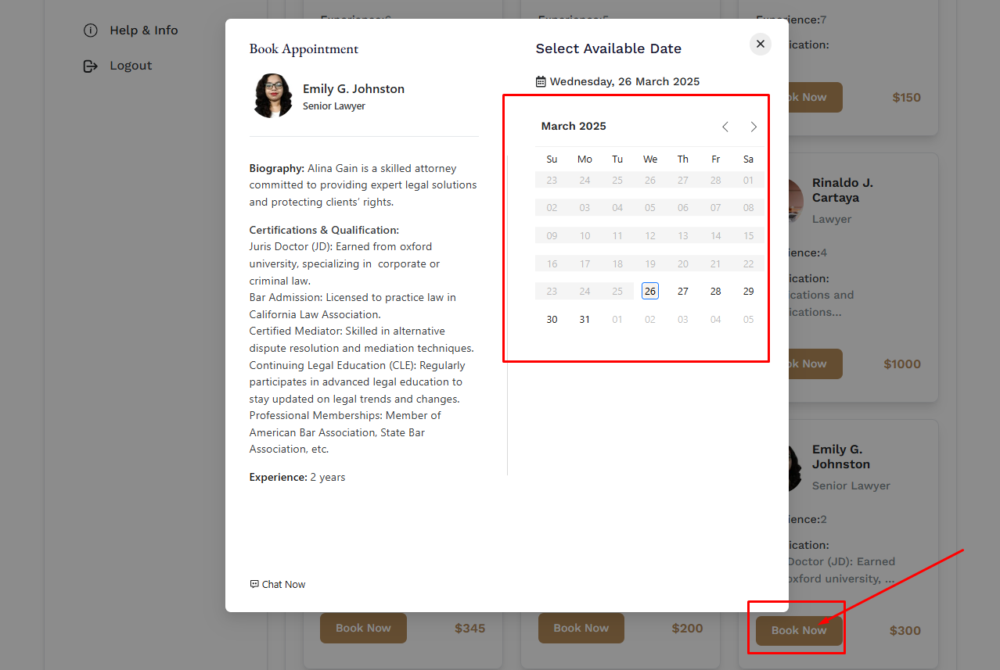
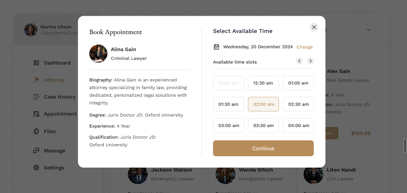
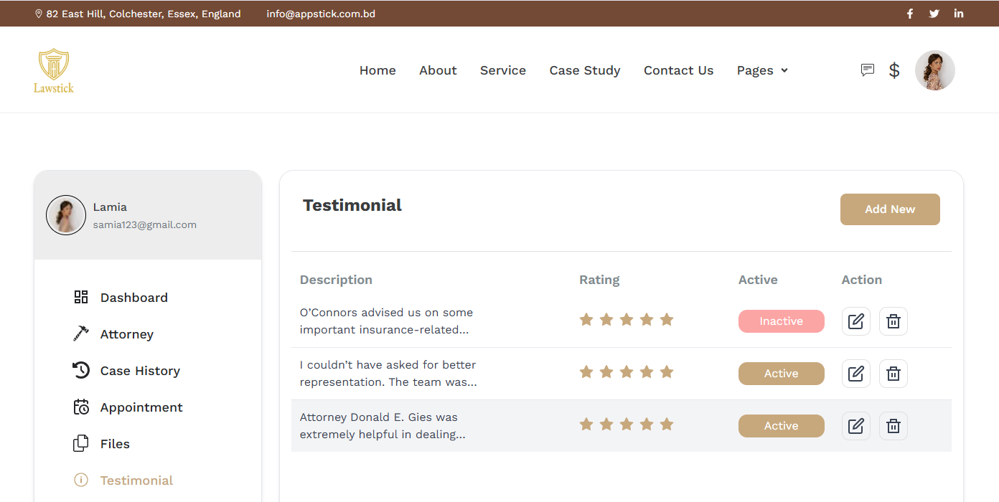

# Attorneys

- In this section, uses can see all of attorneys .
- user can search a specific attorney by using the **Search Bar**.

## Here is how to book an appointment?

- To book an appointment, click on the **Book Now** button.

- A calendar will appear, select the date and time for the appointment and click on the **continue** button.

- After that, fill in the case information and give your evidence .

- Now, select on the payment method and click on the **continue** button you will see a confirmation modal and click on **Send case Request** to send the case request.

- Now, you will redirect to your payment page to make the payment.

