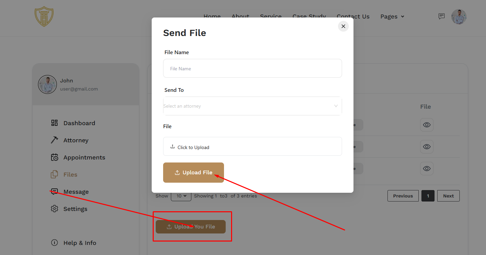

# Files

- In this section, the user can see all the existing files .

## Here is how to upload a file !

- To upload a file, click on the **Upload File** button. 

- A modal will appear, fill in the required details and click **Upload File** to upload the file.

## Here is how to view a file !

- To view a file, click on the file name in the list to open it.
- You can also download the file by clicking the **Evidance** button.

